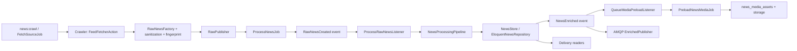

# 00. Обзор Документации и Карта Проекта

Этот набор документов нужен не только для онбординга, но и как материал для подготовки к собеседованию по Laravel/PHP backend. Ниже нет попытки "продать" архитектуру в идеальном виде. Наоборот: цель этой серии файлов в том, чтобы объяснить, как проект **реально работает сейчас**, где в нём сильные решения, а где есть осознанные компромиссы.

Важно: `docs/architecture/` — это не весь слой документации проекта. Для практического старта, API-примеров, `.env` и runtime-операций теперь есть отдельные разделы `docs/start/`, `docs/guides/` и `docs/reference/`.

## Зачем существует эта часть системы

`docs/architecture/` теперь играет роль:

1. Навигационной карты по модульному монолиту.
2. Учебника по runtime-потокам проекта.
3. Шпаргалки перед собеседованием.
4. Честного реестра текущих ограничений.

Если ты хочешь быстро восстановить в голове весь проект перед интервью, начинай с этого файла, а затем иди по одной из траекторий чтения ниже.

## Что за проект

`SmartNews Aggregator` — это Laravel 12 backend на PHP 8.5 в стиле modular monolith. Система делает четыре большие вещи:

1. Читает внешние источники новостей (`RSS`, `Telegram`).
2. Прогоняет сырые данные через асинхронный pipeline обогащения.
3. Хранит нормализованные новости и связанные медиа в PostgreSQL и файловом storage.
4. Отдаёт результат наружу через HTTP API, web-ленту и admin-интерфейсы.

На уровне кода проект разделён на модули:

| Модуль | Ответственность | Ключевая идея |
| --- | --- | --- |
| `Crawler` | Забрать сырой контент извне и привести к общему формату | Внешний интернет "грязный", поэтому здесь много адаптеров и защит |
| `Intelligence` | Обработать сырой контент и принять решение о публикации | Сейчас AI-логика в основном эвристическая |
| `Catalog` | Хранить новости, источники и медиа | Это фактический persistence layer проекта |
| `Delivery` | Читать подготовленные данные и отдавать клиентам | Read-model слой без парсинга и enrichment |
| `Shared` | Общие DTO, события, enum-ы, shared services | Контракты общения между модулями |

## Как читать этот набор документов

### Если ты впервые в проекте и хочешь сначала руками увидеть систему

Сначала открой:

1. [Быстрый старт для новичка](../start/junior-onboarding.md)
2. [News API: запросы и ответы](../reference/api/news-api.md)
3. [Runtime и операционные процессы](../guides/runtime-operations.md)
4. [Конфигурация окружения](../reference/config/env.md)
5. [Учебный маршрут по проекту](../start/learning-path.md)

А уже потом возвращайся к этой серии документов за архитектурной картиной и подробным runtime-разбором.

### Траектория 1. Быстро освежить проект перед собеседованием

1. [00. Обзор Документации и Карта Проекта](00-overview.md)
2. [10. Сквозные Runtime-Сценарии](10-end-to-end-flows.md)
3. [11. Модель Данных, Таблицы и Индексы](11-data-model-and-indexes.md)
4. [12. События, Очереди и Messaging](12-events-queues-and-messaging.md)
5. [15. Банк Вопросов и Ответов для Собеседования](../interview/15-question-bank.md)
6. [16. Глоссарий и Быстрая Шпаргалка](../interview/16-glossary-and-cheatsheet.md)
7. [17. Текущие Ограничения и Архитектурные Компромиссы](17-known-limitations-and-tradeoffs.md)

### Траектория 2. Глубоко понять реализацию

1. [01. Точки Входа, Boot Lifecycle и Octane Runtime](01-entrypoint.md)
2. [02. Framework Layer: Что Реально Живёт в app/](02-app.md)
3. [03. Модуль Delivery: Как Проект Отдаёт Данные Наружу](03-delivery.md)
4. [04. Модуль Crawler: Получение Сырого Контента](04-crawler.md)
5. [05. Модуль Intelligence: Pipeline Обработки Сырой Новости](05-intelligence.md)
6. [06. Модули Catalog и Shared: Хранение, Контракты и Межмодульные События](06-catalog-shared.md)
7. [07. Админка, Диагностика и Operational Debugging](07-admin-and-debugging.md)
8. [08. Инфраструктура: Docker, Сервисы, Makefile и Контейнерный Runtime](08-infrastructure.md)
9. [14. Тестирование и Quality Gates](14-testing-and-quality-gates.md)

### Траектория 3. Понять, куда писать новый код

1. [02. Framework Layer: Что Реально Живёт в app/](02-app.md)
2. [03. Модуль Delivery: Как Проект Отдаёт Данные Наружу](03-delivery.md)
3. [04. Модуль Crawler: Получение Сырого Контента](04-crawler.md)
4. [05. Модуль Intelligence: Pipeline Обработки Сырой Новости](05-intelligence.md)
5. [06. Модули Catalog и Shared: Хранение, Контракты и Межмодульные События](06-catalog-shared.md)
6. [09. Как Добавлять Новую Фичу в Этот Проект](../guides/09-adding-a-feature.md)
7. [17. Текущие Ограничения и Архитектурные Компромиссы](17-known-limitations-and-tradeoffs.md)

## Карта документов

| Файл | О чём он |
| --- | --- |
| [Быстрый старт для новичка](../start/junior-onboarding.md) | Практический старт для новичка: поднять проект, заполнить demo-данными и пройти первые живые сценарии |
| [News API: запросы и ответы](../reference/api/news-api.md) | Примеры запросов и ответов News API, shape JSON и коды ответов |
| [Конфигурация окружения](../reference/config/env.md) | Объяснение ключевых `.env`-переменных и типовых симптомов неверной настройки |
| [Runtime и операционные процессы](../guides/runtime-operations.md) | Что реально запущено в runtime: Octane, worker, scheduler, ручные CLI-команды |
| [Учебный маршрут по проекту](../start/learning-path.md) | Пошаговый учебный маршрут по проекту для джуна |
| [00. Обзор Документации и Карта Проекта](00-overview.md) | Общая карта, словарь и сценарии чтения |
| [01. Точки Входа, Boot Lifecycle и Octane Runtime](01-entrypoint.md) | Boot lifecycle, Octane, RoadRunner, worker-процессы |
| [02. Framework Layer: Что Реально Живёт в app/](02-app.md) | Framework glue-слой: `app/`, провайдеры, контроллеры, middleware, команды |
| [03. Модуль Delivery: Как Проект Отдаёт Данные Наружу](03-delivery.md) | Чтение и отдача новостей наружу |
| [04. Модуль Crawler: Получение Сырого Контента](04-crawler.md) | Получение сырого контента из RSS и Telegram |
| [05. Модуль Intelligence: Pipeline Обработки Сырой Новости](05-intelligence.md) | Pipeline обработки сырой новости |
| [06. Модули Catalog и Shared: Хранение, Контракты и Межмодульные События](06-catalog-shared.md) | Хранение, общие DTO, события, репозитории |
| [07. Админка, Диагностика и Operational Debugging](07-admin-and-debugging.md) | Admin API, Filament, health, Telescope, ручная диагностика |
| [08. Инфраструктура: Docker, Сервисы, Makefile и Контейнерный Runtime](08-infrastructure.md) | Docker, сервисы, Makefile, контейнерный runtime |
| [09. Как Добавлять Новую Фичу в Этот Проект](../guides/09-adding-a-feature.md) | Практический playbook по добавлению фич |
| [10. Сквозные Runtime-Сценарии](10-end-to-end-flows.md) | Сквозные сценарии от источника до ответа API |
| [11. Модель Данных, Таблицы и Индексы](11-data-model-and-indexes.md) | Таблицы, поля, индексы, JSONB, ограничения |
| [12. События, Очереди и Messaging](12-events-queues-and-messaging.md) | Laravel Queue и AMQP messaging |
| [13. Безопасность, Отказы и Failure Modes](13-security-and-failure-modes.md) | SSRF, sanitization, backoff, дедупликация, отказные сценарии |
| [14. Тестирование и Quality Gates](14-testing-and-quality-gates.md) | Unit/feature/arch tests и quality gates |
| [15. Банк Вопросов и Ответов для Собеседования](../interview/15-question-bank.md) | Большой набор вопросов и ответов |
| [16. Глоссарий и Быстрая Шпаргалка](../interview/16-glossary-and-cheatsheet.md) | Быстрая шпаргалка по сущностям и потокам |
| [17. Текущие Ограничения и Архитектурные Компромиссы](17-known-limitations-and-tradeoffs.md) | Текущие ограничения и технические компромиссы |

## Два главных runtime-сценария

### Сценарий 1. От внешнего источника до публикации в ленте

### Сценарий 2. От HTTP-запроса до JSON-ответа

Эти два сценария подробно разобраны в документе [10. Сквозные Runtime-Сценарии](10-end-to-end-flows.md).

## Архитектурная рамка проекта

### Что здесь действительно соблюдается

1. Бизнес-код разделён по модулям.
2. Внутри модулей есть разделение на `Domain`, `Application`, `Infrastructure`.
3. Контракты и DTO действительно используются как точки связи.
4. Межмодульное общение часто идёт через события, а не через прямые вызовы.
5. Архитектурные тесты реально проверяют часть ограничений.

### Что важно не идеализировать

1. Не весь код в `app/` идеально тонкий, хотя направление именно такое.
2. Некоторые runtime-сценарии используют Eloquent-модели прямо из framework-слоя.
3. Intelligence-модуль пока больше похож на skeleton с эвристиками, чем на настоящий LLM orchestration layer.
4. В схеме есть элементы "на вырост", которые пока не участвуют в активном потоке, например `news_vectors`.
5. Некоторые интерфейсы выглядят доменно, но фактически обслуживают конкретный persistence/read-model сценарий.

Именно поэтому дальше в документации часто встречается формулировка "задумано так, но сейчас реализовано вот так".

## Ключевые директории

| Путь | Роль |
| --- | --- |
| `app/` | Framework layer и glue-код Laravel |
| `src/Modules/` | Основные бизнес-модули и shared kernel |
| `config/` | Конфигурация runtime-политик, messaging и интеграций |
| `routes/` | HTTP и CLI точки входа |
| `database/migrations/` | Схема БД |
| `tests/` | Проверка поведения и архитектурных ограничений |
| `docker/`, `docker-compose.yml`, `Makefile` | Локальная инфраструктура и orchestration |

## Глоссарий верхнего уровня

| Термин | Что означает именно в этом проекте |
| --- | --- |
| `Source` | Источник новостей: RSS-лента или Telegram-канал |
| `RawNewsData` | Нормализованное сырьё после парсинга, но до enrichment |
| `EnrichedNewsData` | DTO после pipeline, готовый к сохранению и публикации |
| `NewsStore` | Контракт shared-уровня для сохранения новостей |
| `NewsRepository` | Контракт Catalog-модуля для работы с persisted news |
| `NewsFeedReader` | Контракт Delivery-модуля на read-модель ленты |
| `RawNewsCreated` | Domain event, который запускает Intelligence-поток |
| `NewsEnriched` | Domain event после сохранения обогащённой новости |
| `crawler_tasks` | Laravel queue для задач fetch источников |
| `intelligence_tasks` | Laravel queue для обработки сырых новостей |
| `media_tasks` | Laravel queue для скачивания локальных медиа |
| `news_flow` | RabbitMQ topic exchange для AMQP-публикации обогащённых новостей |

## На что особенно смотреть перед собеседованием

1. Почему проект выбрал modular monolith, а не микросервисы.
2. Как сочетаются Laravel и Hexagonal/Ports-and-Adapters подход.
3. Чем отличаются Laravel Queue и AMQP exchange в этом проекте.
4. Как устроена дедупликация и почему она двухслойная: код + unique index.
5. Что меняется из-за Octane/RoadRunner и long-lived process model.
6. Почему `Delivery` читает только `published` новости.
7. Где есть компромиссы между "чистой архитектурой" и скоростью разработки.

## Что могут спросить на собеседовании

### Вопрос
Почему здесь modular monolith, а не набор микросервисов?

**Короткий ответ:** потому что домен уже разбит на модули, но эксплуатационная сложность микросервисов для текущего масштаба была бы выше пользы.

**Развёрнутый ответ:** модули `Crawler`, `Intelligence`, `Catalog`, `Delivery`, `Shared` уже дают изоляцию на уровне кода, контрактов и тестов. При этом проект разворачивается одним приложением Laravel и не требует сетевых границ между внутренними частями. Но когда нужна асинхронность и loose coupling, используются события и очереди.

**На что обратить внимание:** важно не говорить, что "модульный монолит всегда лучше". Правильнее сказать: "для текущего размера системы это хороший компромисс".

### Вопрос
Где в проекте граница между `app/` и `src/Modules/`?

**Короткий ответ:** `app/` содержит framework/glue-код Laravel, а `src/Modules/` содержит модульную бизнес-логику.

**Развёрнутый ответ:** контроллеры, middleware, providers, console commands, Filament/Livewire живут в `app/`, потому что это Laravel-specific surface. Сценарии, контракты, репозитории, парсеры, pipeline-steps и shared DTO живут в `src/Modules/`.

**На что обратить внимание:** в реальности есть компромиссы, например `NewsCrawlCommand` использует модель `Source` напрямую.

### Вопрос
Почему документация так много говорит о runtime-потоках, а не только о классах?

**Короткий ответ:** потому что главный риск здесь не в одиночных классах, а в связях между HTTP, очередями, событиями, БД и воркерами.

**Развёрнутый ответ:** если понимать только отдельные классы, легко пропустить, где и как формируются данные, когда они сериализуются в job, где срабатывает дедупликация, кто публикует `NewsEnriched`, и когда появляются локальные медиа.

**На что обратить внимание:** на интервью почти всегда оценивают именно способность объяснить flow, а не только синтаксис класса.

## Куда смотреть в коде

- `bootstrap/app.php`
- `app/Providers/ModulesServiceProvider.php`
- `app/Providers/AppServiceProvider.php`
- `routes/api.php`
- `routes/web.php`
- `app/Console/Commands/NewsCrawlCommand.php`
- `src/Modules/Crawler/Application/Actions/FeedFetcherAction.php`
- `src/Modules/Crawler/Application/Jobs/ProcessNewsJob.php`
- `src/Modules/Intelligence/Application/Listeners/ProcessRawNewsListener.php`
- `src/Modules/Intelligence/Application/Pipeline/NewsProcessingPipeline.php`
- `src/Modules/Catalog/Infrastructure/Persistence/EloquentNewsRepository.php`
- `src/Modules/Delivery/Infrastructure/Persistence/EloquentNewsFeedReader.php`

## Куда идти дальше

- Если ты только входишь в проект и хочешь сначала руками получить рабочий результат: [Быстрый старт для новичка](../start/junior-onboarding.md)
- Если нужен практический API-слой с примерами JSON: [News API: запросы и ответы](../reference/api/news-api.md)
- Если хочешь понять, какие процессы реально живут в Docker runtime: [Runtime и операционные процессы](../guides/runtime-operations.md)
- Если хочешь понять lifecycle процесса и влияние Octane: [01. Точки Входа, Boot Lifecycle и Octane Runtime](01-entrypoint.md)
- Если хочешь понять, как Laravel "склеивает" модули: [02. Framework Layer: Что Реально Живёт в app/](02-app.md)
- Если нужен сразу сквозной runtime-разбор: [10. Сквозные Runtime-Сценарии](10-end-to-end-flows.md)
