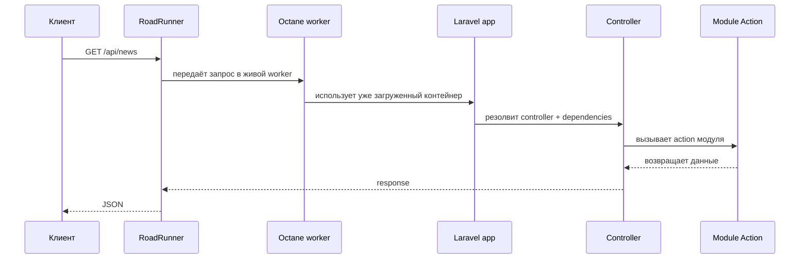

# 01. Точки Входа, Boot Lifecycle и Octane Runtime

Этот файл объясняет, как приложение реально стартует и почему его нельзя анализировать как классический Laravel на `php-fpm`. Для интервью это одна из самых ценных тем, потому что здесь пересекаются framework internals, Docker runtime и особенности long-lived процессов.

## Зачем существует эта часть системы

Пока ты не понимаешь, **кто поднимает процесс**, **когда загружается контейнер**, **что живёт между запросами**, и **как воркеры обрабатывают очереди**, вся остальная архитектура воспринимается слишком абстрактно.

В этом проекте есть три главных входа:

1. HTTP-запрос через RoadRunner + Octane.
2. CLI-команды через `php artisan ...`.
3. Очереди через worker-процесс `queue:work`.

Плюс есть важная четвёртая сущность, которую легко перепутать с полноценным runtime:

4. Laravel schedule definition в `routes/console.php`.

Важно: schedule в коде описан, но в текущем локальном Docker-стеке нет отдельного выделенного scheduler-процесса. Для практического operational-разбора смотри также [Runtime и операционные процессы](../guides/runtime-operations.md).

## Ключевые файлы и классы

| Файл | Роль |
| --- | --- |
| `bootstrap/app.php` | Базовая конфигурация Laravel-приложения |
| `docker/bin/start-octane.sh` | Старт HTTP-процесса с RoadRunner |
| `docker/bin/start-worker.sh` | Старт worker-процесса очередей |
| `.rr.yaml` | Конфигурация RoadRunner reload plugin |
| `docker-compose.yml` | Сервисы `app`, `worker`, `postgres`, `redis`, `rabbitmq` |
| `Makefile` | Основные developer-команды |
| `app/Providers/ModulesServiceProvider.php` | Подключение модулей в контейнер |

## Boot lifecycle приложения

### 1. Конфигурация базового приложения

В `bootstrap/app.php` Laravel настраивается так:

- web routes: `routes/web.php`
- api routes: `routes/api.php`
- console routes: `routes/console.php`
- health route: `/up`
- дополнительный provider: `ModulesServiceProvider`
- middleware alias `role.admin`

Это важно: модульные service provider-ы не прописываются вручную в `config/app.php`, а поднимаются через `ModulesServiceProvider`, который уже добавлен в bootstrap-конфигурацию приложения.

### 2. Загрузка framework-level providers

При старте процесса Laravel строит сервис-контейнер и вызывает:

- базовые framework providers;
- `AppServiceProvider`;
- `ModulesServiceProvider`;
- а уже тот регистрирует `CrawlerServiceProvider`, `IntelligenceServiceProvider`, `CatalogServiceProvider`, `DeliveryServiceProvider`.

### 3. Регистрация зависимостей модулей

На этом этапе биндятся:

- read contracts Delivery;
- repositories Catalog;
- pipeline steps Intelligence;
- HTTP-клиенты и parser resolvers Crawler;
- shared services, например `FingerprintGenerator`.

Именно поэтому дальше контроллеры и jobs могут просить интерфейсы, а контейнер подставляет реализации.

## HTTP entrypoint: RoadRunner + Octane

### Как стартует сервер

В контейнере `app` HTTP runtime поднимается через `docker/bin/start-octane.sh`. Скрипт делает несколько вещей:

1. Берёт бинарник RoadRunner (`rr`) из проектной директории.
2. Копирует его в `/tmp/roadrunner-bin/rr`.
3. Если бинарник сломан или отсутствует, скачивает новый через `vendor/bin/rr get-binary`.
4. Добавляет `/tmp/roadrunner-bin` в `PATH`.
5. Запускает:

```bash
php artisan octane:start \
  --server=roadrunner \
  --rr-config=.rr.yaml \
  --host=0.0.0.0 \
  --rpc-port=6001 \
  --port=8000
```

Снаружи этот порт пробрасывается Docker Compose на `localhost:${APP_PORT:-8080}`.

### Что делает `.rr.yaml`

Сейчас `.rr.yaml` включает `reload` plugin, который следит за изменениями в:

- `app`
- `bootstrap`
- `config`
- `database`
- `resources`
- `routes`
- `src/Modules`

Это удобно для локальной разработки, но не отменяет требования проекта: **после изменения кода перед проверкой нужно делать `php artisan octane:reload`**, если используешь уже запущенный long-lived сервер.

### Почему Octane меняет правила игры

В классическом PHP-FPM каждый запрос стартует процесс заново и после ответа заканчивается. В Octane/RoadRunner воркер живёт долго:

1. Процесс загружает Laravel один раз.
2. Держит сервис-контейнер и часть состояния в памяти.
3. Обрабатывает много запросов подряд.

Это даёт производительность, но требует дисциплины:

- нельзя хранить request-specific состояние в static properties;
- нельзя полагаться на "смерть процесса" как на механизм очистки;
- нужно осторожно относиться к singleton-сервисам и кэшу в памяти;
- особенно опасно в long-lived runtime делать mutable shared state в сервисах.

## Sequence diagram для HTTP-запроса



## CLI entrypoint: artisan commands

Второй тип входа — команды, например:

- `news:crawl`
- `news:media:backfill`
- `news:messaging:setup`
- `app:health-check`

Их жизненный цикл ближе к обычному CLI-приложению:

1. Процесс стартует.
2. Laravel bootstrap-ится.
3. Команда выполняет `handle()`.
4. Процесс завершается.

То есть здесь нет долгоживущего HTTP-worker поведения, но есть другая особенность: команды часто запускаются **внутри контейнера `app`**, а не на хосте напрямую. Это важное project-specific правило.

## Queue entrypoint: отдельный worker-процесс

Контейнер `worker` в `docker-compose.yml` запускает `docker/bin/start-worker.sh`. Этот скрипт:

1. Явно декларативно создаёт очереди `crawler_tasks`, `intelligence_tasks`, `media_tasks`.
2. Затем запускает:

```bash
php artisan queue:work \
  --queue=crawler_tasks,intelligence_tasks,media_tasks \
  --tries=3 \
  --sleep=1 \
  --timeout=120
```

Важно понимать: это **отдельный long-running процесс**, отличный от HTTP runtime.

Он:

- не принимает web-запросы;
- читает сообщения из RabbitMQ как Laravel queue backend;
- выполняет jobs и queued listeners;
- имеет собственный lifecycle и собственные риски утечки состояния.

## Где в проекте встречаются long-lived процессы

| Процесс | Long-lived | Что он делает |
| --- | --- | --- |
| `app` + Octane | Да | Обрабатывает HTTP |
| `worker` + queue:work | Да | Обрабатывает jobs и queued listeners |
| artisan одноразовая команда | Нет | Выполняет точечную CLI-задачу |

## Когда нужен `octane:reload`

По правилам проекта reload обязателен после изменения кода перед ручной проверкой поведения приложения. Это связано с тем, что код уже загружен в живой процесс.

Практически:

- если ты изменил класс контроллера, action, reader, provider, middleware или view logic и сразу проверяешь HTTP ответ, нужен `octane:reload`;
- если запускаешь `make test`, `make test-arch`, `make acceptance` или `make agent-check`, reload уже встроен в make targets;
- если правишь только документацию, reload не нужен.

## Компромиссы и риски

### Что здесь хорошо

1. Быстрый локальный HTTP runtime.
2. Похожая модель long-lived процессов для web и worker части.
3. Явный контейнерный запуск через скрипты.

### Что здесь требует дисциплины

1. Неочевидные баги из-за singleton/stateful сервисов.
2. Разница между "код изменился на диске" и "код реально перезагружен в process memory".
3. Более высокая цена неправильной работы со статическим состоянием, чем в PHP-FPM.

## Что важно для Octane/RoadRunner и очередей

1. Любой singleton должен быть либо stateless, либо очень аккуратно написан.
2. Нельзя кэшировать текущий запрос или текущего пользователя внутри shared mutable state.
3. Любой runtime diagnostic надо интерпретировать с учётом того, что процесс может жить давно.
4. Ошибка может воспроизводиться только после reload или только без reload — это отдельный класс багов.

## Что могут спросить на собеседовании

### Вопрос
Чем этот проект отличается от обычного Laravel на PHP-FPM?

**Короткий ответ:** HTTP обслуживается не `php-fpm`, а `Octane + RoadRunner`, поэтому процессы живут долго и Laravel не bootstrap-ится с нуля на каждый запрос.

**Развёрнутый ответ:** контейнер `app` поднимает RoadRunner, а тот держит несколько PHP-воркеров Octane. Эти воркеры обрабатывают много запросов подряд. Производительность выше, но возрастает требовательность к чистоте state management.

**На что обратить внимание:** обязательно упомяни long-lived state и необходимость `octane:reload`.

### Вопрос
Почему в проекте отдельный `worker`, если уже есть `app`?

**Короткий ответ:** потому что HTTP и queue processing — разные runtime-роли с разными нагрузками и lifecycle.

**Развёрнутый ответ:** `app` обслуживает web/API запросы, `worker` читает очереди `crawler_tasks`, `intelligence_tasks`, `media_tasks`. Это даёт независимое масштабирование и изоляцию: падение или перегрузка воркеров не обязаны ломать HTTP слой напрямую.

**На что обратить внимание:** здесь RabbitMQ используется и как queue backend Laravel, и отдельно как AMQP transport.

### Вопрос
Зачем проект требует ручной `octane:reload`, если есть `.rr.yaml` reload?

**Короткий ответ:** автоперезагрузка помогает локальной разработке, но проектное правило требует явного reload перед проверкой, чтобы не полагаться на магию и исключить ложные результаты.

**Развёрнутый ответ:** `reload` plugin отслеживает изменения файлов, но надёжнее считать reload явным шагом. Это особенно важно при проверке behaviour-sensitive правок и в долгоживущем runtime.

**На что обратить внимание:** на интервью полезно сказать, что такая дисциплина уменьшает класс "призрачных багов".

## Куда смотреть в коде

- `bootstrap/app.php`
- `docker/bin/start-octane.sh`
- `docker/bin/start-worker.sh`
- `.rr.yaml`
- `docker-compose.yml`
- `Makefile`
- `app/Providers/ModulesServiceProvider.php`

## Связанные документы

- [Runtime и операционные процессы](../guides/runtime-operations.md) — практическая карта runtime-процессов, scheduler-а и ручных команд
- [02. Framework Layer: Что Реально Живёт в app/](02-app.md) — что именно bootstrap-ится внутри `app/`
- [08. Инфраструктура: Docker, Сервисы, Makefile и Контейнерный Runtime](08-infrastructure.md) — как это упаковано в Docker
- [12. События, Очереди и Messaging](12-events-queues-and-messaging.md) — как поверх этого runtime устроены очереди и messaging
