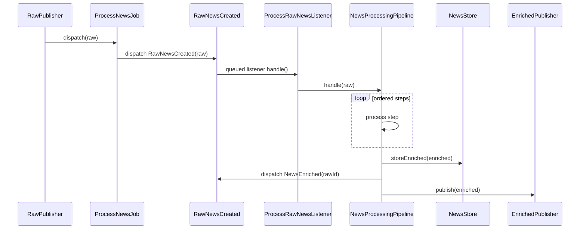

# 05. Модуль Intelligence: Pipeline Обработки Сырой Новости

`Intelligence` — это место, где проект принимает решение, что делать с уже нормализованной сырой новостью. Важно сразу зафиксировать: по названию может показаться, что здесь крутится полноценный LLM orchestration engine. На практике сейчас модуль ближе к конвейеру с эвристическими адаптерами и несколькими extension points под будущие AI-провайдеры.

## Зачем существует эта часть системы

После `Crawler` у системы есть `RawNewsData`, но этого ещё недостаточно для ленты. Нужно:

- исключить повторную обработку дублей;
- нормализовать язык;
- при необходимости перевести текст;
- классифицировать категорию;
- оценить тональность;
- отметить важность;
- при необходимости отклонить материал;
- собрать финальный DTO и сохранить его.

Эту работу и делает `Intelligence`.

## Ключевые классы, контракты и файлы

| Путь | Роль |
| --- | --- |
| `src/Modules/Crawler/Application/Jobs/ProcessNewsJob.php` | Job, который приносит сырой DTO в intelligence queue |
| `src/Modules/Shared/Domain/Events/RawNewsCreated.php` | Событие запуска pipeline |
| `src/Modules/Intelligence/Application/Listeners/ProcessRawNewsListener.php` | Queue listener, который стартует pipeline |
| `src/Modules/Intelligence/Application/Pipeline/NewsProcessingPipeline.php` | Центральный orchestrator pipeline |
| `src/Modules/Intelligence/Application/Pipeline/Steps/*.php` | Отдельные шаги конвейера |
| `src/Modules/Intelligence/Infrastructure/LLM/*.php` | Реализации translator/classifier/sentiment/title contracts |
| `src/Modules/Intelligence/Infrastructure/Messaging/EnrichedPublisher.php` | Публикация AMQP-события после enrichment |
| `src/Modules/Intelligence/IntelligenceServiceProvider.php` | Порядок шагов и биндинги адаптеров |

## Очень важное фактическое уточнение по потоку

Частая ошибка: считать, что `ProcessNewsJob` сразу "обрабатывает интеллект". Это не так.

### Реальный поток такой

1. `RawPublisher` диспатчит `ProcessNewsJob`.
2. `ProcessNewsJob` **не вызывает pipeline напрямую**.
3. `ProcessNewsJob` публикует domain event `RawNewsCreated`.
4. `ProcessRawNewsListener` слушает это событие в очереди `intelligence_tasks`.
5. Только listener вызывает `NewsProcessingPipeline`.

Это важно и для понимания связности, и для понимания точек расширения.

## Sequence diagram: что реально происходит

## `ProcessRawNewsListener`

Listener реализует `ShouldQueue` и обрабатывается в очереди `intelligence_tasks`.

Параметры:

- `tries = 5`
- `backoff = [5, 15, 60, 120, 300]`

То есть intelligence pipeline уже встроен в retry model Laravel Queue.

## `NewsProcessingPipeline`

Это центральный orchestrator.

### Что делает pipeline

1. Принимает `RawNewsData`.
2. Последовательно пропускает его через массив `PipelineStep`.
3. Если шаг выбрасывает `SkipMessageException`, обработка завершается без ошибки.
4. Если в конце получен `EnrichedNewsData`, pipeline:
   - вызывает `NewsStore::storeEnriched()`;
   - генерирует `NewsEnriched($rawId)`;
   - публикует AMQP-сообщение через `EnrichedPublisher`.

### Что pipeline не делает

- не знает, что такое Eloquent;
- не знает деталей PostgreSQL schema;
- не знает деталей RabbitMQ topology;
- не знает, кто потом будет скачивать медиа.

Он опирается только на контракты `NewsStore` и `EnrichedPublisher`.

## Порядок шагов pipeline

Порядок задаётся в `IntelligenceServiceProvider` и сейчас такой:

1. `DeduplicateStep`
2. `LanguageDetectStep`
3. `TranslateStep`
4. `ClassifyStep`
5. `SentimentStep`
6. `AntiClickbaitStep`
7. `ImportanceStep`
8. `ModerationStep`
9. `FinalizeStep`

Этот порядок важен. Например, `ImportanceStep` опирается на результаты classification и sentiment, а `FinalizeStep` должен идти после модерации.

## Разбор шагов по одному

### 1. `DeduplicateStep`

Это первый и один из самых важных шагов.

Что он делает:

1. Проверяет `NewsStore::existsByFingerprint($input->fingerprint)`.
2. Если fingerprint уже существует, бросает `SkipMessageException('duplicate')`.
3. Если новости ещё нет, вызывает `NewsStore::storeRaw($input)`.
4. Возвращает копию `RawNewsData` с заполненным `rawId`.

Почему это важно:

- здесь появляется первичная persisted запись в `news_items`;
- статус на этом этапе — `processing`;
- дальнейшие шаги уже работают с DTO, привязанным к raw-row в БД.

### 2. `LanguageDetectStep`

Несмотря на название, сейчас это не настоящий language detector.

Реальное поведение:

- если `input->language` не пустой, он сохраняется как есть;
- иначе ставится fallback `en`.

То есть это шаг нормализации языка, а не полноценного определения языка текста.

### 3. `TranslateStep`

Если язык уже `ru`, шаг ничего не делает.

Если язык другой:

1. вызывает контракт `Translator`;
2. сохраняет исходный текст и язык в `metadata` как:
   - `original_content`
   - `original_language`
3. заменяет `content` на переведённый текст;
4. ставит `language = ru`.

Сейчас `Translator` забинжен на `HeuristicTranslator`, а тот просто возвращает исходный текст без перевода. Это важно проговаривать честно: **translation pipeline wiring есть, но реального перевода по факту нет**.

### 4. `ClassifyStep`

Вызывает `Classifier::classify($content)`.

Сейчас используется `KeywordClassifier`, который по подстрокам ищет категорию и теги.

Примеры:

- `laravel`, `php`, `ai` -> `IT`
- `econom`, `market` -> `Экономика`
- `polit` -> `Политика`
- `crime`, `кримин` -> `Криминал`

Результат пишет в `metadata`.

### 5. `SentimentStep`

Вызывает `SentimentAnalyzer::score($content)`.

Сейчас используется `KeywordSentimentAnalyzer`, который:

- добавляет очки за positive words;
- вычитает очки за negative words;
- ограничивает диапазон `-10..10`.

Это не ML-модель и не LLM-анализ тональности. Это rule-based heuristic analyzer.

### 6. `AntiClickbaitStep`

Здесь лежит один из важнейших компромиссов текущей реализации.

Хотя в проекте есть:

- контракт `TitleGenerator`;
- реализация `ObjectivelyTitleGenerator`;
- биндинг этого контракта в provider-е;

сам `AntiClickbaitStep` сейчас фактически `no-op` и просто возвращает вход без изменений.

То есть anti-clickbait stage зарезервирован архитектурно, но пока не участвует в реальном runtime-изменении DTO.

### 7. `ImportanceStep`

Опирается на:

- `metadata['category']`
- `metadata['sentiment']`

Считает новость важной, если:

- категория одна из `Экономика`, `Политика`, `IT`;
- `abs(sentiment) > 3`

Результат пишет в `metadata['importance']`.

### 8. `ModerationStep`

Сейчас moderation rule крайне простая.

Если категория равна `бытовой криминал` в lowercase-проверке, шаг немедленно возвращает `EnrichedNewsData` со статусом:

- `NewsStatus::REJECTED`
- `moderationReason = household_crime`

Иначе пропускает DTO дальше.

Это значит, что moderation может завершить pipeline созданием финального DTO ещё до `FinalizeStep`.

### 9. `FinalizeStep`

Если input уже `EnrichedNewsData`, шаг просто возвращает его.

Если input ещё `RawNewsData`, шаг строит `EnrichedNewsData`:

- `rawId`
- `titleGenerated = null`
- `contentTranslated = input->content`
- `sentiment`
- `category`
- `tags`
- `importance`
- `status = published`
- `moderationReason = null`
- `fingerprint`

Заметь два важных нюанса:

1. `titleGenerated` сейчас остаётся `null`, потому что anti-clickbait generator не интегрирован в реальный runtime.
2. `contentTranslated` может быть фактически тем же самым текстом, потому что translator сейчас heuristic stub.

## Infrastructure adapters: что здесь реально "AI", а что нет

| Контракт | Реализация сейчас | Фактическое поведение |
| --- | --- | --- |
| `Translator` | `HeuristicTranslator` | Возвращает исходный текст |
| `Classifier` | `KeywordClassifier` | Простая классификация по подстрокам |
| `SentimentAnalyzer` | `KeywordSentimentAnalyzer` | Подсчёт очков по словарю |
| `TitleGenerator` | `ObjectivelyTitleGenerator` | Реализация есть, но шаг её сейчас не использует |

Это важная interview-тема: архитектура уже подготовлена под LLM adapters, но реальный runtime пока mostly heuristic.

## `EnrichedPublisher`: что публикуется в RabbitMQ

После сохранения pipeline публикует сообщение в exchange `news_flow`.

Routing key выбирается так:

- `enriched.rejected`, если статус `rejected`
- `enriched.ready`, если статус не `rejected`
- дополнительно `enriched.ready.important`, если новость важная и не rejected

Сообщение:

- JSON payload
- `delivery_mode = 2`
- `message_id = fingerprint`
- AMQP header `x-important = 1`, если `importance = true`

То есть AMQP-публикация — это внешний integration surface, отделённый от Laravel Queue.

## Какие данные здесь проходят и как они меняются

| Этап | Формат |
| --- | --- |
| До pipeline | `RawNewsData` без `rawId` |
| После `DeduplicateStep` | `RawNewsData` с `rawId` |
| После classification/sentiment/importance | `RawNewsData` с enriched `metadata` |
| После moderation/finalize | `EnrichedNewsData` |
| После pipeline | запись в `news_items` + `NewsEnriched` + AMQP event |

## Какие есть ограничения, риски и edge cases

1. `LanguageDetectStep` не делает реального определения языка.
2. `TranslateStep` архитектурно есть, но по факту не переводит.
3. `AntiClickbaitStep` сейчас no-op.
4. `TitleGenerator` подключён, но фактически не участвует в конвейере.
5. Moderation очень примитивная и держится на строковом сравнении категории.
6. Pipeline полагается на корректный fingerprint и на идемпотентность persistence layer.

## Что важно для Octane/RoadRunner и очередей

1. Pipeline запускается не в HTTP request, а в queued listener-е.
2. Ретраи и backoff задаются через queue semantics listener-а/job-а.
3. Любой step должен быть максимально stateless и deterministic, чтобы безопасно работать в long-running worker.
4. `SkipMessageException` — это доменный способ "завершить нормально без успеха публикации".

## Что могут спросить на собеседовании

### Вопрос
Где в проекте реально начинается intelligence pipeline?

**Короткий ответ:** не в `ProcessNewsJob`, а в `ProcessRawNewsListener`, который слушает `RawNewsCreated`.

**Развёрнутый ответ:** job играет роль транспортного контейнера. Он приносит `RawNewsData` в очередь и диспатчит domain event. Сам pipeline запускается queued listener-ом. Это уменьшает связность между transport-level job и domain/application orchestration.

**На что обратить внимание:** это одна из главных фактических деталей проекта.

### Вопрос
Можно ли назвать текущий Intelligence AI-модулем в полном смысле?

**Короткий ответ:** архитектурно да, по фактической реализации пока нет.

**Развёрнутый ответ:** контракты и pipeline уже готовы под real AI adapters, но текущие реализации — heuristic translator/classifier/sentiment analyzer, а anti-clickbait вообще не меняет данные в runtime.

**На что обратить внимание:** честность здесь ценнее, чем попытка выдать эвристику за полноценный AI.

### Вопрос
Почему `DeduplicateStep` идёт первым?

**Короткий ответ:** чтобы как можно раньше остановить повторную обработку.

**Развёрнутый ответ:** если fingerprint уже известен, нет смысла тратить вычисления на перевод, классификацию, тональность, модерацию и публикацию. Кроме того, именно этот шаг создаёт raw-запись и присваивает `rawId`.

**На что обратить внимание:** свяжи ответ с `NewsStore` и unique index по `raw_fingerprint`.

## Куда смотреть в коде

- `src/Modules/Crawler/Application/Jobs/ProcessNewsJob.php`
- `src/Modules/Shared/Domain/Events/RawNewsCreated.php`
- `src/Modules/Intelligence/Application/Listeners/ProcessRawNewsListener.php`
- `src/Modules/Intelligence/Application/Pipeline/NewsProcessingPipeline.php`
- `src/Modules/Intelligence/Application/Pipeline/Steps/DeduplicateStep.php`
- `src/Modules/Intelligence/Application/Pipeline/Steps/TranslateStep.php`
- `src/Modules/Intelligence/Application/Pipeline/Steps/ClassifyStep.php`
- `src/Modules/Intelligence/Application/Pipeline/Steps/SentimentStep.php`
- `src/Modules/Intelligence/Application/Pipeline/Steps/AntiClickbaitStep.php`
- `src/Modules/Intelligence/Application/Pipeline/Steps/ImportanceStep.php`
- `src/Modules/Intelligence/Application/Pipeline/Steps/ModerationStep.php`
- `src/Modules/Intelligence/Application/Pipeline/Steps/FinalizeStep.php`
- `src/Modules/Intelligence/Infrastructure/LLM/*.php`
- `src/Modules/Intelligence/Infrastructure/Messaging/EnrichedPublisher.php`
- `src/Modules/Intelligence/IntelligenceServiceProvider.php`

## Связанные документы

- [06. Модули Catalog и Shared: Хранение, Контракты и Межмодульные События](06-catalog-shared.md) — куда pipeline сохраняет результат
- [12. События, Очереди и Messaging](12-events-queues-and-messaging.md) — различие между Laravel Queue и AMQP публикацией
- [17. Текущие Ограничения и Архитектурные Компромиссы](17-known-limitations-and-tradeoffs.md) — почему Intelligence сейчас частично skeletal
