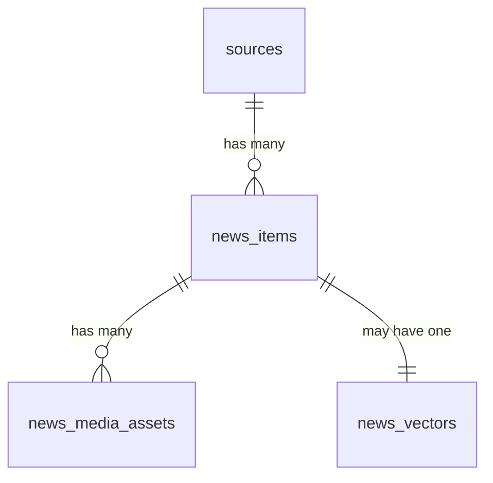

# 11. Модель Данных, Таблицы и Индексы

Этот файл описывает не абстрактные "сущности домена", а фактическую схему базы, которая развёрнута миграциями проекта.

## Зачем существует эта часть системы

На собеседовании по backend почти всегда задают вопросы уровня:

- какие таблицы здесь есть и кто ими владеет;
- почему выбран именно такой набор полей;
- зачем JSONB;
- как решена дедупликация;
- какие индексы ускоряют ленту;
- что хранится отдельно от `news_items`.

## Карта таблиц

| Таблица | Назначение |
| --- | --- |
| `sources` | Конфигурация источников и их operational health state |
| `news_items` | Основное хранилище сырых и обогащённых новостей |
| `news_media_assets` | Lifecycle локально скачиваемых медиа |
| `news_vectors` | Подготовленное место под vector/embedding storage |
| `users` | Пользователи и роли для auth/admin |

---

## Таблица `sources`

### Откуда берётся

`database/migrations/2026_02_11_000001_create_sources_table.php`

### Основные поля

| Поле | Тип | Смысл |
| --- | --- | --- |
| `id` | `bigIncrements` | PK источника |
| `name` | `string` | Читаемое имя |
| `url` | `string` | RSS URL или указание на Telegram канал |
| `type` | `string` | Тип источника, сейчас в runtime используются `rss` и `telegram` |
| `language_default` | `string nullable` | Язык по умолчанию для источника |
| `cron_expression` | `string nullable` | Потенциальная scheduler-конфигурация |
| `is_active` | `boolean` | Участвует ли источник в краулинге |
| `retry_backoff_state` | `jsonb nullable` | Runtime backoff состояние |
| `last_success_at` | `timestampTz nullable` | Последний успешный fetch |
| `last_error_at` | `timestampTz nullable` | Последний провал fetch |
| `error_streak` | `unsignedSmallInteger` | Серия ошибок |

### Что важно

Эта таблица содержит одновременно:

- конфигурацию источника;
- runtime operational metadata.

Это упрощает управление, но смешивает "описание источника" и "временное здоровье источника" в одной сущности.

---

## Таблица `news_items`

### Откуда берётся

- `2026_02_11_000002_create_news_items_table.php`
- `2026_02_11_000003_add_media_to_news_items_table.php`
- `2026_02_16_135637_change_news_items_titles_to_text.php`
- `2026_02_26_000031_add_news_items_query_indexes.php`

### Основные поля

| Поле | Тип | Смысл |
| --- | --- | --- |
| `id` | `id()` | PK |
| `source_id` | `unsignedBigInteger` | FK на `sources` |
| `title_original` | `text` | Оригинальный заголовок |
| `content_original` | `text` | Исходный текст |
| `title_generated` | `text nullable` | Генерируемый/антикликбейтный заголовок |
| `content_translated` | `text nullable` | Переведённый/нормализованный текст |
| `image_url` | `string(2048) nullable` | Оригинальная cover image URL |
| `media` | `jsonb nullable` | Набор исходных media refs |
| `sentiment_score` | `smallInteger` | Тональность |
| `tags` | `jsonb nullable` | Теги классификации |
| `is_important` | `boolean` | Важность новости |
| `status` | `string` | `processing/published/rejected` |
| `source_metadata` | `jsonb nullable` | Гибкие дополнительные данные источника |
| `raw_fingerprint` | `string unique` | Детектор уникальности |
| `moderation_reason` | `string nullable` | Причина отклонения |
| `published_at` | `timestampTz nullable` | Время публикации в источнике |
| `created_at/updated_at` | `timestampsTz` | Laravel timestamps |

### Что именно хранится в `source_metadata`

При сохранении raw news туда попадают:

- `external_id`
- `link`
- `language`

Плюс metadata из crawler factory, например:

- `author`
- `categories`
- `source_url`
- `links`

То есть `source_metadata` — это мягко типизированный контейнер для полей, которые полезны, но не вынесены в жёсткую схему.

### Почему заголовки стали `text`

Есть миграция `change_news_items_titles_to_text`. Это означает, что проект уже столкнулся с риском слишком длинных заголовков и осознанно ушёл от `string` к `text`.

---

## Таблица `news_media_assets`

### Откуда берётся

`database/migrations/2026_02_20_000005_create_news_media_assets_table.php`

### Основные поля

| Поле | Тип | Смысл |
| --- | --- | --- |
| `id` | `id()` | PK ассета |
| `news_item_id` | `foreignId` | FK на `news_items` |
| `slot` | `string(32)` | Логический слот: cover/gallery |
| `position` | `unsignedInteger` | Порядок в gallery |
| `source_url` | `string(2048) nullable` | Исходный URL |
| `source_mime_type` | `string(191) nullable` | MIME, пришедший из источника |
| `local_disk` | `string(64)` | Laravel disk, обычно `public` |
| `local_path` | `string(2048) nullable` | Путь локального файла |
| `downloaded_mime_type` | `string(191) nullable` | MIME уже скачанного файла |
| `file_size_bytes` | `unsignedBigInteger nullable` | Размер файла |
| `checksum_sha256` | `char(64) nullable` | Хэш содержимого |
| `download_status` | `string(32)` | `pending/downloaded/failed` |
| `last_error` | `text nullable` | Текст последней ошибки |
| `downloaded_at` | `timestampTz nullable` | Когда ассет скачан |

### Зачем отдельная таблица

Потому что lifecycle скачивания файлов:

- асинхронный;
- многошаговый;
- содержит служебные статусы и ошибки;
- потенциально множественный.

Такую информацию неудобно и вредно хранить прямо в `news_items`.

---

## Таблица `news_vectors`

### Откуда берётся

Создаётся в `2026_02_11_000002_create_news_items_table.php`.

### Поля

| Поле | Тип | Смысл |
| --- | --- | --- |
| `news_item_id` | `foreignId primary` | 1:1 связь с `news_items` |
| `embedding` | `binary` | Хранилище embedding-вектора |

### Ключевой факт

Таблица **есть**, но в активном runtime-потоке текущего проекта она не используется. Это нужно проговаривать честно: схема подготовлена под возможную vector-логику, но код её сейчас не задействует.

---

## Таблица `users`

Для интервью здесь достаточно помнить:

- используется стандартная Laravel auth-модель;
- есть поле `role`;
- текущая RBAC-логика завязана на `role = admin`.

---

## Индексы и зачем они нужны

### `raw_fingerprint` unique

Главная техническая гарантия идемпотентности.

Используется для:

- недопущения дублей;
- безопасной повторной обработки;
- защиты от race conditions.

### `news_items_source_status_feed_idx`

Составной индекс по:

- `source_id`
- `status`
- `published_at`
- `id`

Он нужен под feed queries и cursor-based сортировку/фильтрацию.

### `news_items_feed_idx`

Составной индекс по:

- `status`
- `published_at`
- `id`

Он поддерживает общий сценарий ленты без фильтра по конкретному источнику.

### `news_items_source_status_idx`

Составной индекс по:

- `source_id`
- `status`

Полезен для более узких выборок и служебных сценариев по источнику.

### `news_items_tags_gin_idx`

GIN index по `tags jsonb_path_ops`.

Полезен для `whereJsonContains(tags, ...)`.

### `news_items_title_original_trgm_idx`

GIN + trigram индекс по `title_original`.

### `news_items_title_generated_trgm_idx`

GIN + trigram индекс по `title_generated`.

Оба trigram индекса нужны под `ILIKE` поиск в Delivery.

### `news_media_assets_slot_unique`

Unique по:

- `news_item_id`
- `slot`
- `position`

Это защищает структуру набора ассетов от дубликатов внутри одной новости.

### `news_media_assets_status_idx`

Индекс по:

- `news_item_id`
- `download_status`

Полезен для выборки кандидатов на скачивание.

## Связи между таблицами

## Как данные эволюционируют по ходу жизни новости

1. `Crawler` генерирует `RawNewsData`.
2. `DeduplicateStep` создаёт `news_items` запись со статусом `processing`.
3. `FinalizeStep`/`ModerationStep` приводят к `EnrichedNewsData`.
4. `storeEnriched()` обновляет ту же запись:
   - enrichment fields;
   - `published` или `rejected`.
5. `PreloadNewsMediaAction` создаёт/обновляет `news_media_assets`.
6. `Delivery` читает `news_items` и дополняет ответ resolved media state.

## Что могут спросить на собеседовании

### Вопрос
Почему часть полей вынесена в JSONB, а часть в явные колонки?

**Короткий ответ:** часто фильтруемые и ключевые поля вынесены в схему, а гибкие metadata-поля оставлены в JSONB.

### Вопрос
Почему у `news_items` и `news_media_assets` разные обязанности?

**Короткий ответ:** `news_items` хранит контент и его статус, а `news_media_assets` хранит lifecycle локальных файлов.

### Вопрос
Как feed search ускоряется на PostgreSQL?

**Короткий ответ:** через trigram GIN индексы по `title_original` и `title_generated`, плюс GIN по `tags`.

## Куда смотреть в коде

- `database/migrations/2026_02_11_000001_create_sources_table.php`
- `database/migrations/2026_02_11_000002_create_news_items_table.php`
- `database/migrations/2026_02_11_000003_add_media_to_news_items_table.php`
- `database/migrations/2026_02_16_135637_change_news_items_titles_to_text.php`
- `database/migrations/2026_02_20_000005_create_news_media_assets_table.php`
- `database/migrations/2026_02_26_000031_add_news_items_query_indexes.php`
- `src/Modules/Catalog/Infrastructure/Persistence/Models/Source.php`
- `src/Modules/Catalog/Infrastructure/Persistence/Models/NewsItem.php`
- `src/Modules/Catalog/Infrastructure/Persistence/Models/NewsMediaAsset.php`

## Связанные документы

- [06. Модули Catalog и Shared: Хранение, Контракты и Межмодульные События](06-catalog-shared.md)
- [03. Модуль Delivery: Как Проект Отдаёт Данные Наружу](03-delivery.md)
- [13. Безопасность, Отказы и Failure Modes](13-security-and-failure-modes.md)
