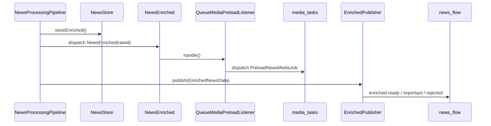

# 12. События, Очереди и Messaging

Это один из самых важных файлов для понимания проекта. Здесь сходятся все асинхронные механизмы системы, и именно здесь чаще всего путают Laravel Queue с AMQP messaging.

## Зачем существует эта часть системы

Проект асинхронен не "в целом", а в нескольких разных смыслах:

1. Внутренние jobs и queued listeners.
2. Межмодульные domain events внутри Laravel.
3. Внешняя публикация результатов в RabbitMQ exchange.

Если не различать эти три уровня, очень легко неправильно объяснить систему.

## Три разных слоя асинхронности

| Уровень | Пример | Зачем нужен |
| --- | --- | --- |
| Laravel job | `FetchSourceJob`, `ProcessNewsJob`, `PreloadNewsMediaJob` | Дорогая работа вне HTTP/CLI потока |
| Laravel event/listener | `RawNewsCreated`, `NewsEnriched`, `SourceFetchFailed` | Слабая связность между модулями |
| AMQP publish | `EnrichedPublisher -> news_flow` | Интеграция с внешними подписчиками |

## Внутренние очереди Laravel

### Какие очереди используются

| Очередь | Кто пишет | Кто читает |
| --- | --- | --- |
| `crawler_tasks` | `NewsCrawlCommand` | `FetchSourceJob` |
| `intelligence_tasks` | `RawPublisher`, queued listener | `ProcessNewsJob`, `ProcessRawNewsListener` |
| `media_tasks` | `QueueMediaPreloadListener`, backfill command | `PreloadNewsMediaJob` |

### Где это видно в коде

- `FetchSourceJob::__construct()` -> `onQueue('crawler_tasks')`
- `ProcessNewsJob::__construct()` -> `onQueue('intelligence_tasks')`
- `PreloadNewsMediaJob::__construct()` -> `onQueue('media_tasks')`
- `ProcessRawNewsListener::viaQueue()` -> `intelligence_tasks`

### Что это значит practically

Даже если событие выглядит "внутри Laravel", его listener может обрабатываться не синхронно, а через queue runtime.

## Внутренние domain events

### `RawNewsCreated`

Продюсер:

- `ProcessNewsJob`

Подписчик:

- `ProcessRawNewsListener`

Назначение:

- отделить transport job от intelligence orchestration.

### `NewsEnriched`

Продюсер:

- `NewsProcessingPipeline`

Подписчик:

- `QueueMediaPreloadListener`

Назначение:

- запустить lifecycle локальных медиа после сохранения enriched news.

### `SourceFetchSucceeded` / `SourceFetchFailed`

Продюсер:

- `FeedFetcherAction`

Подписчик:

- `UpdateSourceStatusListener`

Назначение:

- синхронизировать operational health state источников.

## Полная карта producer -> consumer

| Producer | Механизм | Consumer |
| --- | --- | --- |
| `NewsCrawlCommand` | queue job | `FetchSourceJob` |
| `RawPublisher` | queue job | `ProcessNewsJob` |
| `ProcessNewsJob` | Laravel event | `ProcessRawNewsListener` |
| `NewsProcessingPipeline` | Laravel event | `QueueMediaPreloadListener` |
| `QueueMediaPreloadListener` | queue job | `PreloadNewsMediaJob` |
| `FeedFetcherAction` | Laravel event | `UpdateSourceStatusListener` |
| `EnrichedPublisher` | AMQP publish | внешние consumers |

## Почему `ProcessNewsJob` и `RawNewsCreated` — это не одно и то же

Потому что у них разные роли:

- `ProcessNewsJob` — транспорт и очередь;
- `RawNewsCreated` — доменное событие факта "сырая новость готова к обработке".

Эта развязка позволяет при желании:

- поменять источник события;
- добавить новых слушателей на raw news;
- не зашивать pipeline напрямую в transport job.

## AMQP exchange `news_flow`

### Где настраивается

- `config/messaging.php`
- `app/Services/MessagingTopologyService.php`
- `app/Console/Commands/MessagingSetupCommand.php`

### Параметры exchange

| Параметр | Значение |
| --- | --- |
| Name | `news_flow` |
| Type | `topic` |

### Queue bindings

| Queue | Routing key |
| --- | --- |
| `queue.delivery_feed` | `enriched.ready` |
| `queue.delivery_push` | `enriched.ready.important` |

### Публикуемые routing keys

| Routing key | Когда используется |
| --- | --- |
| `enriched.ready` | Обычная опубликованная новость |
| `enriched.ready.important` | Важная опубликованная новость |
| `enriched.rejected` | Отклонённая новость |

Важно: `MessagingTopologyService` биндит две delivery queues, но publisher умеет публиковать и `enriched.rejected`. То есть не для всех routing keys в текущем setup обязательно уже есть потребитель.

## Sequence diagram: внутренний queue flow vs AMQP flow

## Ретраи и backoff

### Где заданы явно

| Компонент | tries | backoff |
| --- | --- | --- |
| `ProcessNewsJob` | `5` | `[5, 15, 60, 120, 300]` |
| `ProcessRawNewsListener` | `5` | `[5, 15, 60, 120, 300]` |

### Где заданы косвенно

- worker process: `queue:work --tries=3 --timeout=120`
- media HTTP download: `Http::retry(2, 200)`

Нужно уметь объяснить, что retry semantics в проекте распределены по нескольким уровням.

## Что создаёт `news:messaging:setup`

Команда вызывает `MessagingTopologyService`, который:

1. `exchange_declare(news_flow, topic, durable=true)`
2. объявляет `queue.delivery_feed`
3. объявляет `queue.delivery_push`
4. биндит их на нужные routing keys

Для `queue.delivery_push` используется quorum queue.

## Какие есть ограничения, риски и edge cases

1. Не все routing keys exchange-а обязаны иметь настроенных consumers.
2. Внутренний Laravel event и AMQP publish происходят отдельно; успех одного не гарантирует успех другого, если не оборачивать всё в дополнительную надёжную orchestration layer.
3. При анализе асинхронного бага нужно сначала понять, это Laravel Queue проблема или внешняя AMQP messaging проблема.

## Что могут спросить на собеседовании

### Вопрос
В чём разница между `ProcessNewsJob` и `RawNewsCreated`?

**Короткий ответ:** job — это транспорт через очередь, event — доменный факт внутри приложения.

### Вопрос
Почему проект использует и Laravel events, и RabbitMQ exchange?

**Короткий ответ:** Laravel events нужны для внутренних реакций между модулями, а AMQP exchange — для внешней интеграции с подписчиками.

### Вопрос
Что происходит после `NewsEnriched`?

**Короткий ответ:** внутри Laravel стартует media preload, а параллельно наружу публикуется AMQP message.

## Куда смотреть в коде

- `src/Modules/Crawler/Application/Jobs/FetchSourceJob.php`
- `src/Modules/Crawler/Application/Jobs/ProcessNewsJob.php`
- `src/Modules/Intelligence/Application/Listeners/ProcessRawNewsListener.php`
- `src/Modules/Shared/Domain/Events/*.php`
- `src/Modules/Catalog/Application/Listeners/QueueMediaPreloadListener.php`
- `src/Modules/Catalog/Application/Jobs/PreloadNewsMediaJob.php`
- `src/Modules/Intelligence/Infrastructure/Messaging/EnrichedPublisher.php`
- `app/Services/MessagingTopologyService.php`
- `config/messaging.php`

## Связанные документы

- [05. Модуль Intelligence: Pipeline Обработки Сырой Новости](05-intelligence.md)
- [06. Модули Catalog и Shared: Хранение, Контракты и Межмодульные События](06-catalog-shared.md)
- [08. Инфраструктура: Docker, Сервисы, Makefile и Контейнерный Runtime](08-infrastructure.md)
