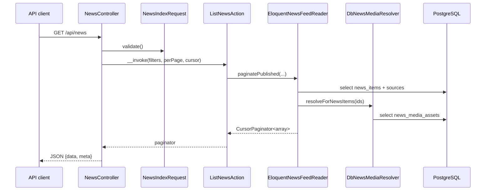

# 03. Модуль Delivery: Как Проект Отдаёт Данные Наружу

`Delivery` — это read-oriented модуль. Он не занимается парсингом, не тянет внешние источники и не обогащает контент. Его задача намного уже: взять уже подготовленные данные и вернуть их в форме, удобной для API и web-клиента.

## Зачем существует эта часть системы

Если `Catalog` отвечает за хранение, а `Intelligence` — за обработку, то `Delivery` отвечает за вопрос: **что и в каком виде увидит клиент**.

На практике это означает:

- фильтрацию по параметрам запроса;
- пагинацию;
- подготовку shape ответа;
- разрешение ссылок на локально сохранённые медиа;
- разделение public/admin reading use-cases.

## Ключевые классы, контракты и файлы

| Путь | Роль |
| --- | --- |
| `routes/api.php` | Публичные и admin API routes |
| `app/Http/Controllers/Api/NewsController.php` | Публичный HTTP entrypoint |
| `app/Http/Controllers/Api/Admin/SourceController.php` | Admin endpoint списка источников |
| `app/Http/Requests/Api/NewsIndexRequest.php` | Валидация фильтров ленты |
| `src/Modules/Delivery/Domain/DTO/NewsFeedFilters.php` | Typed DTO для фильтров |
| `src/Modules/Delivery/Application/Actions/ListNewsAction.php` | Use case списка новостей |
| `src/Modules/Delivery/Application/Actions/ShowNewsAction.php` | Use case карточки новости |
| `src/Modules/Delivery/Application/Actions/ListPublicSourcesAction.php` | Список публичных источников |
| `src/Modules/Delivery/Application/Actions/ListSourcesAction.php` | Список источников для admin API |
| `src/Modules/Delivery/Domain/Contracts/*.php` | Контракты читателей и media resolver |
| `src/Modules/Delivery/Infrastructure/Persistence/*.php` | Реальные DB-backed reader-ы |

## Какие маршруты обслуживает Delivery

| Route | Controller | Action |
| --- | --- | --- |
| `GET /api/news` | `NewsController@index` | `ListNewsAction` |
| `GET /api/news/{id}` | `NewsController@show` | `ShowNewsAction` |
| `GET /api/sources` | `NewsController@sources` | `ListPublicSourcesAction` |
| `GET /api/admin/sources` | `SourceController@index` | `ListSourcesAction` |

## Пошаговый runtime-сценарий: `GET /api/news`

### Шаг 1. Валидация input

`NewsIndexRequest` проверяет:

- `per_page` от 1 до 100;
- `sentiment_min` и `sentiment_max` в диапазоне `-10..10`;
- `important` как boolean;
- `date_from` и `date_to` как date;
- `q` как short text search input.

После этого дополнительная логика валидатора гарантирует:

- `sentiment_min <= sentiment_max`;
- `date_from <= date_to`.

### Шаг 2. Сбор typed DTO

`NewsController@index` создаёт `NewsFeedFilters`:

- `category`
- `sentimentMin`
- `sentimentMax`
- `important`
- `dateFrom`
- `dateTo`
- `query`
- `sourceId`

Контроллер также отдельно вычисляет:

- `perPage`
- `cursor`

То есть есть разделение между "содержательными фильтрами" и transport-level параметрами пагинации.

### Шаг 3. Use case

`ListNewsAction` почти ничего не знает про БД. Он принимает `NewsFeedFilters`, `perPage`, `cursor` и вызывает контракт `NewsFeedReader`.

Это важно для интервью: `Action` здесь не содержит SQL и не знает про Query Builder.

### Шаг 4. Реализация reader-а

Контракт `NewsFeedReader` в контейнере забинжен на `EloquentNewsFeedReader`.

Он:

1. Собирает базовый query через `DatabaseManager`.
2. Присоединяет таблицу `sources`.
3. Фильтрует только `news_items.status = published`.
4. Применяет optional filters.
5. Сортирует по `published_at desc`, затем `id desc`.
6. Делает cursor pagination.
7. После получения rows резолвит локальные медиа через `NewsMediaResolver`.

### Шаг 5. Формирование response shape

`NewsController@index` возвращает:

- `data` — список новостей;
- `meta.per_page`
- `meta.next_cursor`
- `meta.prev_cursor`
- `meta.total`

Обрати внимание: `total` считается отдельным запросом через `ListNewsAction::count()`. Это отдельная read-операция, а не часть cursor paginator.

## Sequence diagram для списка новостей

## Как устроены фильтры в `EloquentNewsFeedReader`

| Фильтр | Как применяется |
| --- | --- |
| `sourceId` | `where news_items.source_id = ?` |
| `category` | `whereJsonContains(tags, category)` |
| `sentimentMin` | `where sentiment_score >= ?` |
| `sentimentMax` | `where sentiment_score <= ?` |
| `important` | `where is_important = ?` |
| `dateFrom` | `where published_at >= ?` |
| `dateTo` | `where published_at <= ?` |
| `query` | `ILIKE`/`LIKE` по `title_original` и `title_generated` |

### Почему здесь Query Builder, а не Eloquent-модели

`Delivery` построен как read-model слой. Для него часто важнее:

- явный контроль select columns;
- предсказуемый shape результата;
- отсутствие лишних model-layer side effects;
- простое преобразование row object -> response array.

Это не значит, что Eloquent плох. Просто здесь Query Builder лучше подходит под ридер.

## `ShowNewsAction`: карточка одной новости

`ShowNewsAction` вызывает `findPublishedById()` у того же `NewsFeedReader`.

Что важно:

1. Ищется только `published` новость.
2. Если запись не найдена, controller отдаёт `404`.
3. Ответ использует тот же общий mapping, что и feed.

## `DbNewsMediaResolver`: зачем он нужен

В `news_items` хранятся оригинальные ссылки (`image_url`, `media`). Но после обогащения и последующей media preloading часть файлов может быть скачана локально в storage и отражена в `news_media_assets`.

`DbNewsMediaResolver` делает следующее:

1. Берёт список `news_item_id`.
2. Читает все `news_media_assets` для этих записей.
3. Строит итоговое состояние:
   - `image_url`
   - `image_url_original`
   - `image_url_local`
   - `media`
   - `media_original`
   - `media_local`
4. Если локальный файл реально существует на диске, отдаёт `Storage::disk(...)->url(...)`.
5. Если локальной копии нет, делает fallback на оригинальный URL.

Это пример хорошей read-side композиции: Delivery знает, как отдавать "эффективную" ссылку клиенту, но не знает, как медиа скачивались.

## Публичные и admin readers для источников

### `EloquentSourcePublicReader`

Возвращает только активные источники и только поля:

- `id`
- `name`

Это значит, что публичный API не светит служебные поля админского характера.

### `EloquentSourceAdminReader`

Возвращает расширенный набор:

- `id`
- `name`
- `url`
- `type`
- `language_default`
- `cron_expression`
- `is_active`
- `last_success_at`
- `last_error_at`
- `error_streak`

То есть admin read model здесь отделён от public read model не только по доступу, но и по форме данных.

## Какие данные здесь проходят и как они меняются

| Этап | Представление данных |
| --- | --- |
| HTTP query | строки и scalar-значения из request |
| Validation | проверенные значения `NewsIndexRequest` |
| DTO | `NewsFeedFilters` |
| Reader result | `CursorPaginator<object>` |
| Mapping | `array<string, mixed>` |
| HTTP response | `JSON` с `data` и `meta` |

## Какие есть ограничения, риски и edge cases

1. `total` считается отдельным запросом, поэтому это не "одна операция".
2. Search сейчас ограничен `title_original` и `title_generated`, без полнотекстового индекса PostgreSQL.
3. `content_original` и `content_translated` читаются прямо в ленту, что может быть тяжело при большом payload.
4. Нет read-side cache.
5. Курсорная пагинация требует стабильной сортировки, поэтому сортировка жёстко привязана к `published_at, id`.
6. `status` жёстко фильтруется по `published`, то есть rejected/processing записи не доступны публично.

## Что важно для Octane/RoadRunner и очередей

`Delivery` сам по себе не queue-модуль, но работает поверх данных, которые появляются асинхронно. Это значит:

1. пользователь может увидеть новость до скачивания локального медиа;
2. `DbNewsMediaResolver` обязан уметь корректно работать и с partially completed media state;
3. controller и reader не должны предполагать, что все фоновые шаги уже завершены.

## Что могут спросить на собеседовании

### Вопрос
Почему `Delivery` не использует напрямую `Catalog` contracts?

**Короткий ответ:** потому что `Delivery` строит собственную read-модель и свои контракты чтения.

**Развёрнутый ответ:** модуль Delivery определяет свои интерфейсы `NewsFeedReader`, `SourcePublicReader`, `SourceAdminReader`, `NewsMediaResolver`. Это уменьшает связность: Delivery не обязан подстраиваться под contract shape, который удобен Catalog как persistence-модулю.

**На что обратить внимание:** особенно важно упомянуть `NewsMediaResolver` как локальный Delivery-абстрактный слой.

### Вопрос
Почему список новостей фильтруется только по `published`?

**Короткий ответ:** потому что Delivery отдаёт клиенту только готовый и разрешённый к показу контент.

**Развёрнутый ответ:** статусы `processing` и `rejected` относятся к внутреннему pipeline lifecycle. Публичный API не должен раскрывать сырой или модерационно отклонённый материал.

**На что обратить внимание:** свяжи ответ с модулем `Intelligence` и со статусами из `NewsStatus`.

### Вопрос
Почему для чтения используется cursor pagination, а не offset?

**Короткий ответ:** для стабильной ленты и лучшей производительности на растущем наборе данных.

**Развёрнутый ответ:** offset pagination хуже масштабируется на больших таблицах и плохо сочетается с активным поступлением новых данных. Курсор по `published_at + id` делает ленту устойчивее.

**На что обратить внимание:** упомяни индекс `news_items_source_status_feed_idx`.

## Куда смотреть в коде

- `routes/api.php`
- `app/Http/Controllers/Api/NewsController.php`
- `app/Http/Controllers/Api/Admin/SourceController.php`
- `app/Http/Requests/Api/NewsIndexRequest.php`
- `src/Modules/Delivery/Domain/DTO/NewsFeedFilters.php`
- `src/Modules/Delivery/Application/Actions/ListNewsAction.php`
- `src/Modules/Delivery/Application/Actions/ShowNewsAction.php`
- `src/Modules/Delivery/Application/Actions/ListPublicSourcesAction.php`
- `src/Modules/Delivery/Application/Actions/ListSourcesAction.php`
- `src/Modules/Delivery/Infrastructure/Persistence/EloquentNewsFeedReader.php`
- `src/Modules/Delivery/Infrastructure/Persistence/DbNewsMediaResolver.php`
- `src/Modules/Delivery/Infrastructure/Persistence/EloquentSourcePublicReader.php`
- `src/Modules/Delivery/Infrastructure/Persistence/EloquentSourceAdminReader.php`

## Связанные документы

- [06. Модули Catalog и Shared: Хранение, Контракты и Межмодульные События](06_catalog_shared.md) — откуда появляются persisted news и media assets
- [10. Сквозные Runtime-Сценарии](10_end_to_end_flows.md) — сквозной HTTP flow
- [11. Модель Данных, Таблицы и Индексы](11_data_model_and_indexes.md) — схема таблиц, на которых строится Delivery
