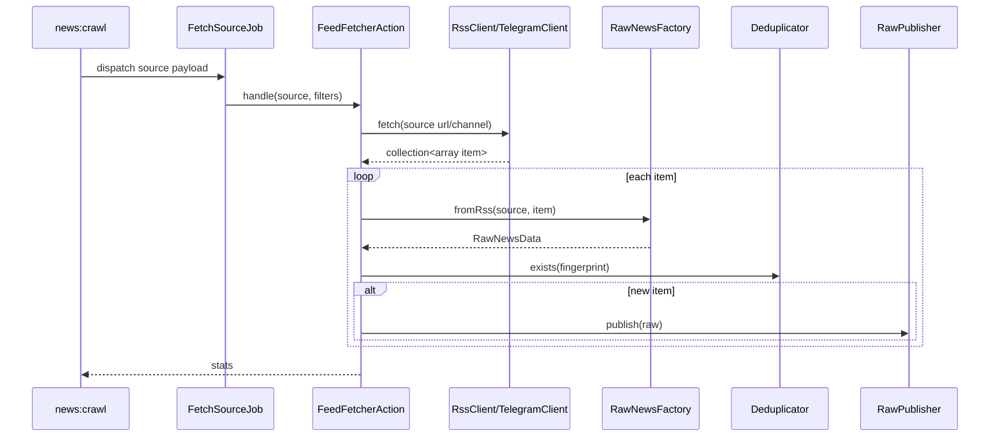

# 04. Модуль Crawler: Получение Сырого Контента

`Crawler` отвечает за самый грязный участок системы: взаимодействие с внешним миром. Здесь приложение получает XML, HTML, ссылки, медиа, потенциально опасный контент и пытается превратить это в стандартизированное и безопасное сырьё для дальнейшего pipeline.

## Зачем существует эта часть системы

Если бы не было `Crawler`, остальные модули пришлось бы загрязнять логикой:

- HTTP-запросов к внешним сайтам;
- парсинга RSS/HTML;
- нормализации неструктурированных данных;
- sanitization;
- защиты от опасных URL;
- первичной дедупликации.

Crawler нужен, чтобы внутренняя система работала уже с нормализованным `RawNewsData`, а не с хаотическим input from internet.

## Ключевые классы, контракты и файлы

| Путь | Роль |
| --- | --- |
| `app/Console/Commands/NewsCrawlCommand.php` | Главная CLI-команда краулинга |
| `src/Modules/Crawler/Application/Jobs/FetchSourceJob.php` | Очередная задача fetch источника |
| `src/Modules/Crawler/Application/Actions/FeedFetcherAction.php` | Центральный orchestrator модуля |
| `src/Modules/Crawler/Application/Services/RawNewsFactory.php` | Построение `RawNewsData` |
| `src/Modules/Crawler/Application/Services/IncomingContentSanitizer.php` | Очистка текста, URL, ссылок, категорий и media |
| `src/Modules/Crawler/Infrastructure/Http/RssClient.php` | Скачивание и разбор RSS |
| `src/Modules/Crawler/Infrastructure/Http/TelegramClient.php` | Скачивание и пагинация Telegram web-view |
| `src/Modules/Crawler/Infrastructure/Services/RssParserResolver.php` | Выбор RSS parser-а |
| `src/Modules/Crawler/Infrastructure/Services/TelegramParserResolver.php` | Выбор Telegram parser-а |
| `src/Modules/Crawler/Infrastructure/Security/SourceUrlPolicy.php` | SSRF hardening и allowlist |
| `src/Modules/Crawler/Infrastructure/Messaging/RawPublisher.php` | Публикация сырой новости в очередь |

## Верхнеуровневый runtime-сценарий



## `NewsCrawlCommand`: orchestration с учётом runtime-политик

### Что делает команда

`news:crawl`:

1. Читает активные источники через Eloquent-модель `Source`.
2. Учитывает `--source-id`.
3. Поддерживает `--date-from`, `--date-to`, `--limit`.
4. Поддерживает `--sync` и `--ignore-backoff`.
5. Для каждого источника вычисляет backoff window через `SourceRuntimeHealthPolicy`.
6. Если `dateFrom` не задан, пытается взять `published_at` последней новости источника из `NewsItem`.
7. Дальше либо диспатчит `FetchSourceJob`, либо синхронно вызывает `FeedFetcherAction`.

### Почему это важно

Эта команда показывает, что framework-level orchestration у проекта прагматичная:

- часть логики аккуратно вынесена в shared service `SourceRuntimeHealthPolicy`;
- но сама команда читает persistence-модели напрямую.

Это не "грязный хак", а текущий компромисс между чистотой и простотой operational flow.

## `FetchSourceJob`: перенос source payload в очередь

Job хранит:

- `source` как array payload;
- `dateFrom`
- `dateTo`
- `limit`

И всегда ставится в очередь `crawler_tasks`.

Почему передаётся массив, а не Eloquent-модель:

1. сериализация job проще и стабильнее;
2. уменьшается привязка к состоянию модели после dispatch;
3. payload явно содержит только то, что нужно fetch flow.

## `FeedFetcherAction`: главный orchestrator crawler-потока

Это центральная точка модуля.

### Что делает `FeedFetcherAction`

1. Понимает тип источника: `rss` или `telegram`.
2. Делегирует скачивание соответствующему клиенту.
3. Получает коллекцию сырых item-массивов.
4. Для каждого item вызывает `RawNewsFactory`.
5. Получает `RawNewsData` с уже рассчитанным fingerprint.
6. Проверяет первичную дедупликацию через `Deduplicator`.
7. Для новых элементов вызывает `RawPublisher`.
8. В конце публикует `SourceFetchSucceeded`.
9. При исключении публикует `SourceFetchFailed` и пробрасывает ошибку дальше.

### Что он не делает

- не сохраняет новость в БД;
- не запускает Intelligence напрямую;
- не знает о том, как сохраняются media assets;
- не занимается финальной публикацией обогащённых событий.

## Почему дедупликация есть уже в Crawler

Это важный момент. В проекте дедупликация двухслойная:

1. В Crawler через `Deduplicator::exists(fingerprint)` — чтобы не плодить лишние jobs.
2. В Intelligence/Catalog через `NewsStore` + unique index — чтобы сохранить идемпотентность даже при гонках.

То есть Crawler-уровень — это не единственная гарантия уникальности, а ранний фильтр нагрузки.

## `RawNewsFactory`: место, где хаос превращается в DTO

`RawNewsFactory::fromRss()` делает очень важную работу.

### На входе

- `source` payload: `id`, `url`, `language_default`
- сырой item-массив из RSS или Telegram parser-а

### На выходе

`RawNewsData` с полями:

- `sourceId`
- `externalId`
- `title`
- `link`
- `content`
- `publishedAt`
- `language`
- `metadata`
- `imageUrl`
- `media`
- `fingerprint`
- `rawId` пока `null`

### Что происходит по дороге

1. `title` и `content` проходят через `sanitizeText()`.
2. `link` и `imageUrl` проходят через `sanitizeUrl()`.
3. `categories`, `links`, `media` очищаются и нормализуются.
4. Язык берётся из item либо из `language_default` источника, иначе fallback — `en`.
5. `publishedAt` парсится как `CarbonImmutable`, при ошибке — `now()`.
6. Через `FingerprintGenerator` DTO получает детерминированный fingerprint.

Это один из самых важных классов проекта с точки зрения качества данных.

## `IncomingContentSanitizer`: проект не хранит сырой HTML как есть

Sanitizer делает несколько уровней очистки.

### Текст

- удаляет опасные HTML-блоки: `script`, `style`, `iframe`, `object`, `embed`, `svg`, `math`;
- выкидывает HTML-комментарии;
- преобразует некоторые block-level теги в line breaks;
- применяет `strip_tags`;
- нормализует whitespace;
- удаляет control chars;
- режет длину по `crawler.security.sanitization.max_text_length`.

### URL

- декодирует HTML entities;
- поддерживает `//example.com` -> `https://example.com`;
- требует схему и host;
- фильтрует по `crawler.security.allowed_url_schemes`.

### Categories / links / media

- удаляет мусорные и пустые значения;
- нормализует и дедуплицирует;
- для media оставляет только `url` и допустимый MIME-like `type`.

Это критично для безопасности и для стабилизации downstream pipeline.

## `SourceUrlPolicy`: SSRF hardening

Перед тем как RSS/Telegram client вообще сходят наружу, URL проверяется policy-слоем.

### Что проверяется

1. Схема URL находится в allowlist `crawler.security.allowed_source_schemes`.
2. Хост проходит allowlist на уровне типа источника:
   - `global`
   - `rss`
   - `telegram`
3. При включённом `deny_private_hosts` запрещаются:
   - `localhost`
   - `.local`
   - `.internal`
   - private/reserved IP ranges

### Почему это важно

Если дать системе без ограничений ходить по URL, администратор или атакующий сможет превратить crawler в SSRF-инструмент.

## RSS flow

### `RssClient`

1. Проверяет URL через `SourceUrlPolicy`.
2. Делает HTTP request через `RssConnector`.
3. Выбирает parser через `RssParserResolver`.
4. Парсит XML в коллекцию item-массивов.
5. Применяет `dateFrom/dateTo` фильтрацию.
6. Ограничивает `limit`.

### `RssParserResolver`

Перебирает tagged parsers и отдаёт первый, у которого `supports($url) === true`. Если ничего специфического не нашлось — fallback на `DefaultRssParser`.

### `DefaultRssParser`

Умеет:

- RSS `channel/item`
- Atom `entry`
- `enclosure`
- `media:content`
- `content:encoded`

То есть это не "тупой XML reader", а parser с несколькими форматами feed-структур.

## Telegram flow

### `TelegramClient`

Это один из самых интересных технических участков проекта.

Он:

1. Нормализует имя канала из `@name`, `t.me/name` или `t.me/s/name`.
2. Строит `https://t.me/s/<channel>`.
3. Проверяет URL через `SourceUrlPolicy`.
4. Идёт по HTML-версии канала.
5. Если нужна пагинация — использует `?before=<post_id>`.
6. Между ajax-like запросами делает random sleep `1..4` секунды.
7. Фильтрует сообщения по диапазону дат.
8. Следит за `seen` по `externalId`.
9. Останавливается по `limit`, отсутствию новых items или достижению старых дат.

### `DefaultTelegramParser`

Парсер работает поверх `DOMDocument` + `DOMXPath` и умеет извлекать:

- `data-post` как `guid/externalId`
- дату публикации
- текст сообщения
- ссылки в тексте
- media thumbnails
- document links
- обложку `image_url`

Это важно проговаривать: Telegram здесь не интегрирован через Bot API или MTProto. Используется web representation канала, поэтому модуль устойчив к чтению публичных каналов, но ограничен тем, что может дать HTML-страница Telegram.

## `RawPublisher`: что реально происходит после краулинга

Очень важное уточнение по фактическому flow.

`RawPublisher` **не обрабатывает** интеллект и **не сохраняет** raw news. Он делает только одно:

```php
dispatch(new ProcessNewsJob($raw));
```

То есть:

1. `FeedFetcherAction` публикует `RawNewsData`.
2. `RawPublisher` превращает это в `ProcessNewsJob`.
3. Job ставится в очередь `intelligence_tasks`.

Следующий этап уже не часть Crawler. Он описан в документе [05. Модуль Intelligence: Pipeline Обработки Сырой Новости](05_intelligence.md).

## Какие данные здесь проходят и как они меняются

| Этап | Представление |
| --- | --- |
| `Source` | URL/channel + тип источника |
| Client result | `Collection<array<string, mixed>>` |
| Factory output | `RawNewsData` |
| Deduplication | fingerprint string |
| Queue publish | `ProcessNewsJob(RawNewsData)` |
| Source health events | `SourceFetchSucceeded` / `SourceFetchFailed` |

## Какие есть ограничения, риски и edge cases

1. Telegram parsing зависит от структуры HTML Telegram web-view.
2. `FeedFetcherAction` сейчас для всех items вызывает `fromRss()` даже для Telegram payload-а, потому что factory фактически общая для обеих форматов.
3. Дата публикации может fallback-нуться на `now()`, если парсинг даты не удался.
4. Ранняя дедупликация не отменяет необходимости DB-level unique constraint.
5. Слишком агрессивная sanitization может урезать часть форматирования и контента.

## Что важно для Octane/RoadRunner и очередей

Crawler живёт на стыке CLI, очередей и внешней сети:

1. краулинг редко должен происходить в HTTP request;
2. `FetchSourceJob` изолирует дорогое fetch-поведение от команды;
3. retry/timeout semantics определяются queue worker-ом, а не только Crawler-кодом;
4. проблемы внешней сети не должны тянуть за собой публичный API.

## Что могут спросить на собеседовании

### Вопрос
Почему проект делает дедупликацию и в Crawler, и в Catalog/DB?

**Короткий ответ:** первый слой экономит ресурсы, второй слой гарантирует идемпотентность.

**Развёрнутый ответ:** Crawler-level dedupe не даёт плодить лишние jobs и лишний downstream traffic. Но при гонках, повторных delivery и concurrent processing единственной надёжной гарантией остаётся DB-level uniqueness по `raw_fingerprint`.

**На что обратить внимание:** это хороший пример defence in depth.

### Вопрос
Почему Telegram интеграция построена через web HTML, а не через официальный API?

**Короткий ответ:** проект читает публичные каналы как источник контента без необходимости полноценной bot/user API интеграции.

**Развёрнутый ответ:** `TelegramClient` и `DefaultTelegramParser` работают по HTML-странице `t.me/s/...`, что упрощает ingestion публичных каналов, но делает систему зависимой от HTML-структуры Telegram.

**На что обратить внимание:** это одновременно pragmatic choice и source of brittleness.

### Вопрос
Где в Crawler происходит очистка опасного контента?

**Короткий ответ:** в `IncomingContentSanitizer`, который вызывается внутри `RawNewsFactory`.

**Развёрнутый ответ:** очистка делается до постановки в pipeline, поэтому downstream steps и storage получают уже нормализованный текст, ссылки, media и categories. Это снижает риск XSS-like payload и нестабильных форматов данных.

**На что обратить внимание:** не путай sanitization и source allowlist — это два разных слоя защиты.

## Куда смотреть в коде

- `app/Console/Commands/NewsCrawlCommand.php`
- `src/Modules/Crawler/Application/Jobs/FetchSourceJob.php`
- `src/Modules/Crawler/Application/Actions/FeedFetcherAction.php`
- `src/Modules/Crawler/Application/Services/RawNewsFactory.php`
- `src/Modules/Crawler/Application/Services/IncomingContentSanitizer.php`
- `src/Modules/Crawler/Infrastructure/Http/RssClient.php`
- `src/Modules/Crawler/Infrastructure/Http/TelegramClient.php`
- `src/Modules/Crawler/Infrastructure/Services/RssParserResolver.php`
- `src/Modules/Crawler/Infrastructure/Services/TelegramParserResolver.php`
- `src/Modules/Crawler/Infrastructure/Parsers/DefaultRssParser.php`
- `src/Modules/Crawler/Infrastructure/Parsers/Telegram/DefaultTelegramParser.php`
- `src/Modules/Crawler/Infrastructure/Security/SourceUrlPolicy.php`
- `src/Modules/Crawler/Infrastructure/Messaging/RawPublisher.php`

## Связанные документы

- [05. Модуль Intelligence: Pipeline Обработки Сырой Новости](05_intelligence.md) — что происходит после `ProcessNewsJob`
- [12. События, Очереди и Messaging](12_events_queues_and_messaging.md) — очереди, в которые публикует Crawler
- [13. Безопасность, Отказы и Failure Modes](13_security_and_failure_modes.md) — защита и отказные сценарии ingestion
