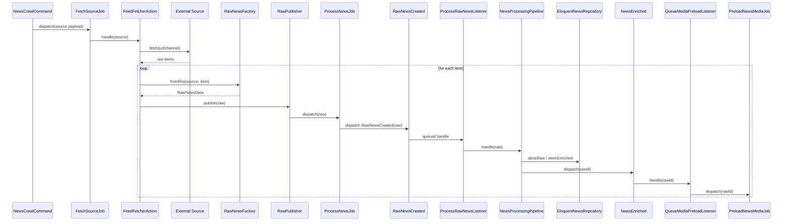
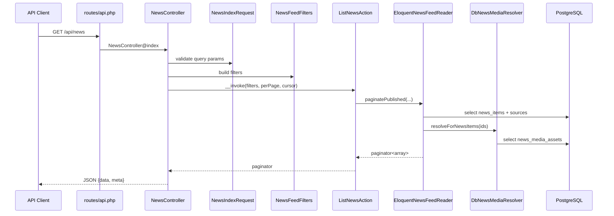
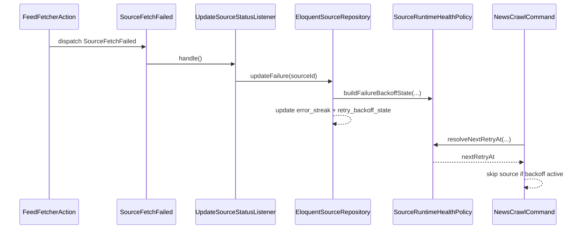

# 10. Сквозные Runtime-Сценарии

Этот файл нужен, чтобы увидеть систему не как набор классов, а как последовательность реальных действий. На собеседовании именно такая способность объяснять flow обычно показывает зрелость лучше, чем перечисление папок.

## Зачем существует эта часть системы

В проекте есть как минимум три важных end-to-end сценария:

1. `crawl -> queue -> intelligence -> catalog -> media -> delivery`
2. `HTTP request -> validation -> action -> reader -> response`
3. `source error -> health tracking -> runtime backoff`

Ниже каждый разобран по шагам.

---

## Сценарий 1. От источника до появления в ленте

### Участники

| Компонент | Роль |
| --- | --- |
| `NewsCrawlCommand` | Находит активные источники и запускает fetch |
| `FetchSourceJob` | Асинхронный transport для конкретного источника |
| `FeedFetcherAction` | orchestration fetch flow |
| `RssClient/TelegramClient` | Получение данных из внешнего мира |
| `RawNewsFactory` | Нормализация item -> `RawNewsData` |
| `Deduplicator` | Ранний фильтр дублей |
| `RawPublisher` | Публикация в очередь intelligence |
| `ProcessNewsJob` | Transport job для сырой новости |
| `RawNewsCreated` | Domain event старта pipeline |
| `ProcessRawNewsListener` | Запускает Intelligence pipeline |
| `NewsProcessingPipeline` | Обрабатывает новость |
| `EloquentNewsRepository` | Хранит raw/enriched запись |
| `QueueMediaPreloadListener` | Стартует media preload |
| `PreloadNewsMediaJob` | Асинхронная загрузка файлов |
| `DbNewsMediaResolver` | Позже подменяет оригинальные URL локальными |

### Полный flow

### Подробный пошаговый разбор

1. `NewsCrawlCommand` выбирает активные источники и пропускает те, что в backoff.
2. Для каждого источника формируется payload-массив, который попадает в `FetchSourceJob`.
3. `FetchSourceJob` вызывает `FeedFetcherAction`.
4. `FeedFetcherAction` по типу источника выбирает `RssClient` или `TelegramClient`.
5. Клиент возвращает коллекцию item-массивов.
6. Каждый item прогоняется через `RawNewsFactory`, который:
   - очищает контент;
   - нормализует поля;
   - вычисляет fingerprint.
7. `Deduplicator` отбрасывает часть дублей ещё до публикации в Intelligence.
8. `RawPublisher` диспатчит `ProcessNewsJob`.
9. `ProcessNewsJob` публикует `RawNewsCreated`.
10. `ProcessRawNewsListener` запускает `NewsProcessingPipeline`.
11. `DeduplicateStep` делает уже persistence-level проверку и создаёт raw-row.
12. Pipeline проходит шаги обогащения и строит `EnrichedNewsData`.
13. `NewsStore::storeEnriched()` обновляет запись в `news_items`.
14. `NewsProcessingPipeline` публикует `NewsEnriched`.
15. `QueueMediaPreloadListener` ставит `PreloadNewsMediaJob`.
16. `PreloadNewsMediaAction` скачивает локальные файлы и заполняет `news_media_assets`.
17. При следующем запросе к ленте Delivery сможет отдать локальные URL медиа.

### Где сценарий может закончиться раньше

| Этап | Причина раннего завершения |
| --- | --- |
| `NewsCrawlCommand` | Источник в backoff |
| `FeedFetcherAction` | ошибка клиента/parsing/source type |
| `Deduplicator` | уже есть такой fingerprint |
| `DeduplicateStep` | duplicate в `NewsStore` |
| `ModerationStep` | запись уходит в `rejected` |
| `PreloadNewsMediaAction` | media download failed, но сама новость остаётся сохранённой |

---

## Сценарий 2. От HTTP-запроса к JSON-ответу

### Flow для `GET /api/news`

### Подробный разбор

1. Route попадает в `NewsController@index`.
2. `NewsIndexRequest` валидирует query string.
3. Контроллер собирает `NewsFeedFilters`.
4. `ListNewsAction` вызывает `NewsFeedReader`.
5. `EloquentNewsFeedReader` фильтрует только `published` новости.
6. Ридер дополняет записи resolved media state.
7. Контроллер возвращает response с `data` и `meta`.

### Что важно

1. `Delivery` не знает о внешних источниках и pipeline.
2. `Delivery` читает уже готовые данные.
3. Media resolution делается в read flow, а не во время сохранения новости.

---

## Сценарий 3. Ошибка источника и runtime backoff

### Flow

### Что здесь важно

1. Ошибка источника не просто логируется, а превращается в operational state.
2. Следующий запуск `news:crawl` это состояние учитывает.
3. Система избегает бесконечного долбления мёртвого источника.

---

## Сценарий 4. Backfill существующих медиа

1. Администратор или разработчик запускает `news:media:backfill`.
2. Команда ищет новости с eligible media.
3. По умолчанию пропускает записи, у которых assets уже существуют.
4. При `--all` переобрабатывает всё.
5. Либо синхронно запускает preload, либо диспатчит `PreloadNewsMediaJob`.

Это независимый операционный flow, не требующий нового краулинга.

## Что могут спросить на собеседовании

### Вопрос
На каком этапе новость впервые попадает в БД?

**Короткий ответ:** в `DeduplicateStep`, когда вызывается `NewsStore::storeRaw`.

### Вопрос
На каком этапе новость становится доступной в ленте?

**Короткий ответ:** после `storeEnriched()` со статусом `published`, потому что Delivery читает только `published`.

### Вопрос
Когда появляются локальные ссылки на картинки?

**Короткий ответ:** только после `NewsEnriched -> QueueMediaPreloadListener -> PreloadNewsMediaJob -> download`.

## Куда смотреть в коде

- `app/Console/Commands/NewsCrawlCommand.php`
- `src/Modules/Crawler/Application/Jobs/FetchSourceJob.php`
- `src/Modules/Crawler/Application/Actions/FeedFetcherAction.php`
- `src/Modules/Crawler/Infrastructure/Messaging/RawPublisher.php`
- `src/Modules/Crawler/Application/Jobs/ProcessNewsJob.php`
- `src/Modules/Intelligence/Application/Listeners/ProcessRawNewsListener.php`
- `src/Modules/Intelligence/Application/Pipeline/NewsProcessingPipeline.php`
- `src/Modules/Catalog/Application/Listeners/QueueMediaPreloadListener.php`
- `src/Modules/Catalog/Application/Actions/PreloadNewsMediaAction.php`
- `src/Modules/Delivery/Infrastructure/Persistence/EloquentNewsFeedReader.php`

## Связанные документы

- [03. Модуль Delivery: Как Проект Отдаёт Данные Наружу](03_delivery.md)
- [04. Модуль Crawler: Получение Сырого Контента](04_crawler.md)
- [05. Модуль Intelligence: Pipeline Обработки Сырой Новости](05_intelligence.md)
- [06. Модули Catalog и Shared: Хранение, Контракты и Межмодульные События](06_catalog_shared.md)
