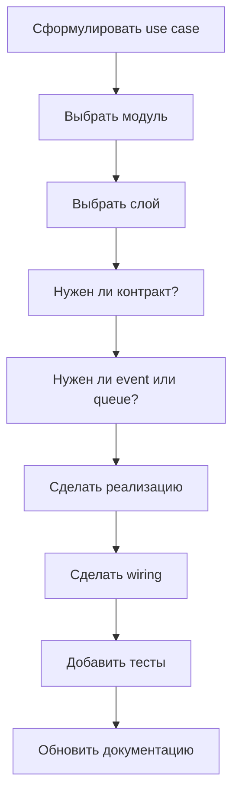

# 09. Как Добавлять Новую Фичу в Этот Проект

Этот файл нужен, чтобы быстро принять правильные архитектурные решения при новой задаче. Он не обещает "идеально чистую" архитектуру в каждом углу проекта, но даёт практический алгоритм, как двигаться в текущем кодовом стиле без разрастания хаоса.

## Зачем существует эта часть системы

В modular monolith самая дорогая ошибка — написать код "куда попало". Обычно проблема не в синтаксисе, а в неправильном выборе:

- модуля;
- слоя;
- контракта;
- способа взаимодействия между частями системы.

Этот playbook отвечает на вопрос: **куда писать конкретную новую логику, если ты понимаешь задачу, но не хочешь ломать архитектуру**.

## Базовое правило выбора места

### Если это transport/framework concern

Пиши в `app/`.

Примеры:

- controller;
- middleware;
- console command;
- Filament resource;
- Livewire component;
- provider;
- readiness/debug tooling.

### Если это бизнес-логика конкретного модуля

Пиши в `src/Modules/<Module>/...`.

### Если это общий межмодульный язык

Рассматривай `src/Modules/Shared`.

Примеры:

- DTO;
- enum;
- event;
- shared service вроде fingerprint/backoff policy.

## Decision tree: как выбрать модуль

| Сценарий | Куда идти |
| --- | --- |
| Нужно читать и отдавать данные клиенту | `Delivery` |
| Нужно получать внешние данные | `Crawler` |
| Нужно обрабатывать raw news и принимать решение о публикации | `Intelligence` |
| Нужно хранить, обновлять или читать persistence state | `Catalog` |
| Нужно связать модули через общий DTO/event/enum | `Shared` |
| Нужно просто дать HTTP/CLI точку входа | `app/` |

## Decision tree: как выбрать слой внутри модуля

### `Domain`

Если ты описываешь:

- контракт;
- инвариант;
- понятие предметной области;
- enum/domain DTO.

### `Application`

Если ты описываешь use case, orchestration, pipeline step, listener, job.

### `Infrastructure`

Если ты:

- работаешь с БД;
- пишешь HTTP client;
- реализуешь контракт;
- интегрируешься с storage, messaging, parser frameworks и т.п.

## Шаблон добавления новой фичи

### Шаг 1. Сформулируй use case

Нужно понять:

1. Откуда приходит входной сигнал.
2. Кто главный потребитель результата.
3. Нужен ли sync response или async flow.
4. Это read-only сценарий или write/update сценарий.
5. Затронуты ли несколько модулей.

### Шаг 2. Определи source of truth

Спроси себя:

- где хранится основное состояние;
- кто имеет право его менять;
- кто только читает read-model.

Пример:

- изменение новостей и источников — `Catalog`;
- чтение ленты — `Delivery`;
- решение о публикации — `Intelligence`.

### Шаг 3. Выбери стиль взаимодействия

| Когда | Как связывать |
| --- | --- |
| Один модуль и один use case | прямой action/contract вызов |
| Межмодульная реакция на факт | `Shared` event |
| Дорогая или отложенная обработка | job / queued listener |
| Внешняя интеграция | infrastructure adapter |

### Шаг 4. Определи, нужен ли новый контракт

Новый интерфейс нужен, если:

- application/domain слой не должен знать про конкретную реализацию;
- нужен extension point;
- ожидается mockability/testability;
- ты не хочешь, чтобы use case зависел от Eloquent/HTTP client напрямую.

Не создавай контракт ради ритуала, если это чисто framework glue или сугубо локальный helper.

### Шаг 5. Добавь реализацию и wiring

Обычно это означает:

1. Контракт в `Domain/Contracts`.
2. Реализацию в `Infrastructure`.
3. Binding в `<Module>ServiceProvider`.
4. Use case/action/listener/job в `Application`.
5. Controller/command/middleware в `app/`, если нужен новый entrypoint.

### Шаг 6. Подумай про async и failure modes

Нужно решить:

- это должно выполняться прямо в HTTP request;
- это должно уйти в очередь;
- что будет при повторном delivery;
- как обеспечивается идемпотентность;
- что будет при частичном успехе.

### Шаг 7. Добавь тесты и документацию

Минимум:

- unit/feature test для нового поведения;
- при необходимости architecture test safety;
- обновление `docs/architecture/`, `docs/guides/` или `docs/reference/`, если изменился важный flow или контракт.

## Практические паттерны для типовых задач

### Сценарий 1. Нужно добавить новый фильтр в ленту

Например, фильтр по `status` или по новому тегу.

Скорее всего нужно:

1. Расширить `NewsIndexRequest`.
2. Расширить `NewsFeedFilters`.
3. Обновить `EloquentNewsFeedReader::baseQuery()`.
4. При необходимости обновить API tests.

Ключевая идея: это `Delivery`-задача, а не `Catalog`-задача.

### Сценарий 2. Нужно добавить новый тип источника

Например, API-провайдер вместо RSS/Telegram.

Скорее всего нужно:

1. Добавить новый тип источника в модель/данные.
2. Добавить client/parser/resolver ветку в `Crawler`.
3. Подумать про `SourceUrlPolicy` и allowlist/security.
4. Обновить команду краулинга и тесты.

Ключевая идея: это прежде всего `Crawler`.

### Сценарий 3. Нужно добавить новый шаг enrichment pipeline

Например, summarization или custom moderation rule.

Скорее всего нужно:

1. Создать новый `PipelineStep`.
2. При необходимости добавить новый контракт в `Intelligence/Domain/Contracts`.
3. Добавить инфраструктурную реализацию.
4. Вставить шаг в правильное место в `IntelligenceServiceProvider`.
5. Обновить документацию о порядке pipeline.

Ключевая идея: порядок шагов — это часть поведения, а не просто wiring.

### Сценарий 4. Нужно, чтобы другой модуль реагировал на событие

Например, после публикации новости нужно инкрементировать метрику или отправить нотификацию.

Скорее всего нужно:

1. Понять, есть ли уже подходящее событие в `Shared`.
2. Если нет — добавить новое событие в `Shared/Domain/Events`.
3. Создать listener в нужном модуле.
4. Подписать listener в service provider-е.

Ключевая идея: для межмодульных реакций чаще лучше событие, чем прямой вызов.

### Сценарий 5. Нужно изменить схему хранения

Например, добавить новое поле к новости или источнику.

Скорее всего нужно:

1. Добавить migration.
2. Обновить модель/репозиторий/reader.
3. Решить, это write-model поле, read-model поле или и то и другое.
4. Обновить tests и документацию.

Ключевая идея: не добавляй поле "просто везде". Сначала пойми, кто им владеет.

## Что не стоит делать

1. Не тащи SQL в controller, если это не ultra-local framework hack.
2. Не пиши бизнес-логику в Filament resource или Livewire component.
3. Не добавляй межмодульную compile-time зависимость, если лучше подходит event.
4. Не делай новый shared contract, если это private detail одного модуля.
5. Не путай Laravel Queue и AMQP exchange.

## Особые правила именно этого проекта

1. Все dev/test команды выполняются внутри Docker.
2. Перед ручной проверкой кода под Octane нужен `octane:reload`.
3. Не нужно вручную редактировать `docs/PROJECT_STRUCTURE.md` и `docs/PROJECT_INTERFACE.md`.
4. После значимых изменений нужно обновлять `docs/PROJECT_MEMORY.md`.

## Нормальный алгоритм внедрения фичи

## Какие есть ограничения, риски и edge cases

1. Проект не идеально "чистый", поэтому иногда придётся принимать pragmatic decisions.
2. Некоторые архитектурные seams уже есть, но ещё не доведены до полноты, особенно в Intelligence.
3. Не всё, что выглядит как Domain abstraction, является глубокой бизнес-моделью; часть контрактов больше про boundary than about rich domain.

## Что важно для Octane/RoadRunner и очередей

1. Не втаскивай stateful mutable singleton-логику в новые сервисы.
2. Всегда решай, sync или async выполнение нужно по сути задачи.
3. Для дорогостоящих действий почти всегда лучше очередь.

## Что могут спросить на собеседовании

### Вопрос
Как ты понимаешь, в какой модуль добавить новую функциональность?

**Короткий ответ:** по владельцу состояния и по главному use case.

**Развёрнутый ответ:** если модуль владеет изменением данных — логика идёт туда. Если модуль только читает и отдаёт shape клиенту — это Delivery. Если речь о внешнем источнике и нормализации сырья — Crawler. Если о принятии решения по raw news — Intelligence.

**На что обратить внимание:** покажи, что ты различаешь ownership и mere consumption.

### Вопрос
Когда лучше использовать event, а когда прямой вызов?

**Короткий ответ:** event — когда нужен межмодульный факт и слабая связность; прямой вызов — когда нужен синхронный результат от конкретного контракта.

**Развёрнутый ответ:** событие хорошо для реакций вроде media preload, source status updates, downstream integrations. Прямой вызов хорош, когда use case не имеет смысла без немедленного результата, например read-model выборка.

**На что обратить внимание:** не надо превращать всё в events.

### Вопрос
Какая типичная ошибка при добавлении фичи в modular monolith?

**Короткий ответ:** писать сразу в `app/` или напрямую в модель, не определив модульного владельца.

**Развёрнутый ответ:** тогда архитектура быстро деградирует: controllers становятся толстыми, read/write concerns смешиваются, модули начинают зависеть друг от друга напрямую, а события и контракты перестают иметь смысл.

**На что обратить внимание:** это хороший момент показать зрелое мышление.

## Куда смотреть в коде

- `app/Providers/ModulesServiceProvider.php`
- `src/Modules/*/*`
- `tests/Architecture/LayerDependenciesTest.php`
- `tests/Architecture/CodeQualityTest.php`
- `app/Console/Commands/NewsCrawlCommand.php`
- `src/Modules/Delivery/Application/Actions/ListNewsAction.php`
- `src/Modules/Crawler/Application/Actions/FeedFetcherAction.php`
- `src/Modules/Intelligence/Application/Pipeline/NewsProcessingPipeline.php`
- `src/Modules/Catalog/Infrastructure/Persistence/EloquentNewsRepository.php`

## Связанные документы

- [10. Сквозные Runtime-Сценарии](10-end-to-end-flows.md) — чтобы видеть реальные сценарии
- [14. Тестирование и Quality Gates](14-testing-and-quality-gates.md) — какие тесты должны страховать новую фичу
- [17. Текущие Ограничения и Архитектурные Компромиссы](17-known-limitations-and-tradeoffs.md) — какие компромиссы уже есть и как не усугубить их
